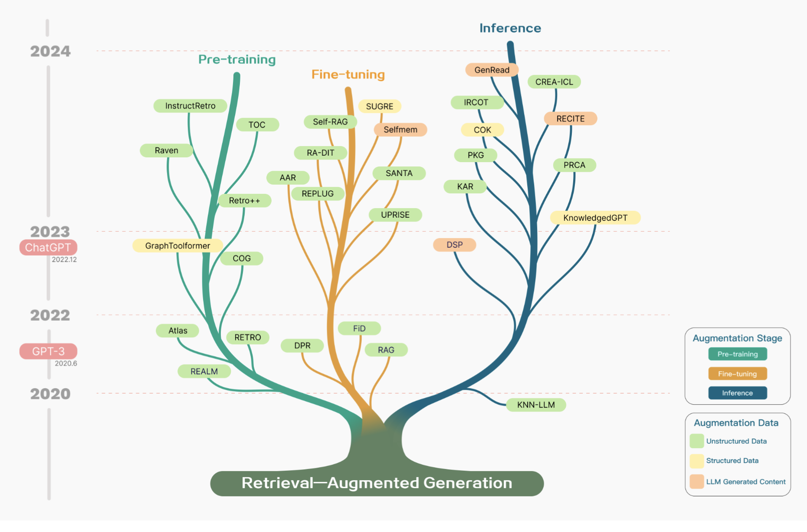
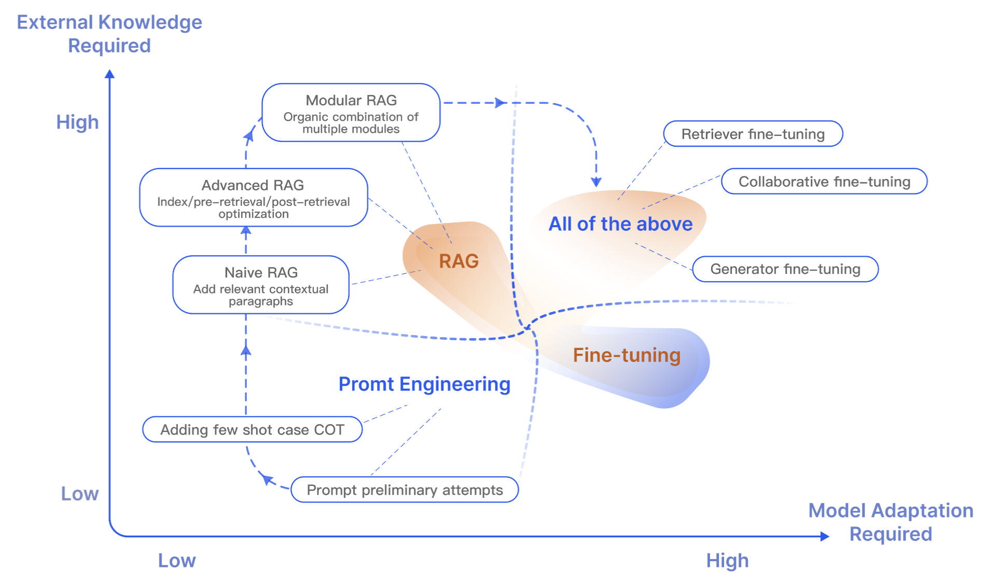
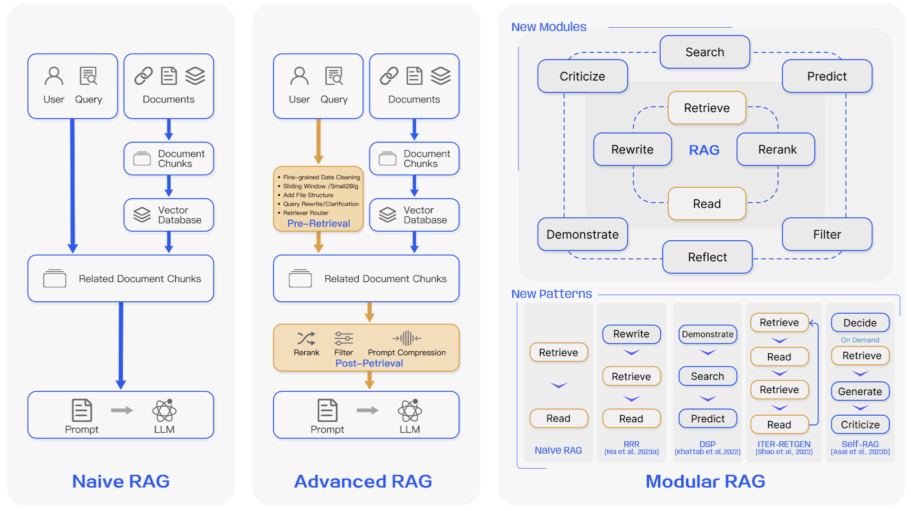

# 大语言模型的检索增强生成技术（RAG）综述

Yunfan Gao 1 , Yun Xiong 2 , Xinyu Gao 2 , Kangxiang Jia 2 , Jinliu Pan 2 , Yuxi Bi 3 , Yi Dai1 , **Jiawei Sun**1 and **Haofen Wang** 1,3 ∗
1 Shanghai Research Institute for Intelligent Autonomous Systems, Tongji University
2 Shanghai Key Laboratory of Data Science, School of Computer Science, Fudan University
3 College of Design and Innovation,Tongji University gaoyunfan1602@gmail.com

## 摘要

大型语言模型（LLMs）虽然能力强大，但在实际应用中还存在一些问题，比如产生不准确的信息、知识更新慢，以及答案的不透明性。检索增强生成（Retrieval-Augmented Generation, RAG）是指在大型语言模型回答问题前，先从外部知识库中检索相关信息的过程。

RAG 被证实可以显著提升答案的准确度，尤其在知识密集型任务中，能有效减少模型生成的错误信息。用户可以通过查看引用的信息来源来核实答案的正确性，这样也增强了对模型输出结果的信任。

此外，RAG 还有助于快速更新知识和引入特定领域的专业知识。

RAG 将大语言模型（LLMs）中的参数化知识与非参数化的外部知识库有效结合，成为了实现大型语言模型的关键方法之一。本文梳理了大语言模型时代 RAG 的发展模式，概括了三种模式：初级 RAG（Naive RAG）、高级 RAG（Advanced RAG）和模块化 RAG（Modular RAG）。接着，文章总结了 RAG 的三大核心组成部分：检索器（retriever）、生成器（generator）和增强方法（augmentation methods），并详细介绍了每个部分的关键技术。此外，文中还探讨了如何评价 RAG 模型的效果，介绍了两种评估 RAG 的方法，并强调了评估过程中的关键指标和能力，同时展示了最新的自动评估框架。最后，文章从纵向优化、横向扩展能力以及 RAG 的技术架构和生态系统三个角度，提出了未来研究的潜在方向。

## 1. 介绍

大语言模型（LLMs）的能力在自然语言处理（NLP）领域达到了前所未有的高度。

包括 OpenAI 在 2020 年和 2023 年发布的 GPT 系列模型 [Brown *et al.*, 2020; OpenAI, 2023]、Touvron *et al.* 在 2023 年提出的 LLama 系列模型，以及 Google 在同年推出的 Gemini 等大型语言模型，在多项评估标准上展现了卓越的语言理解和知识运用能力，甚至在多个领域超过了人类的表现 [Wang *et al.*, 2019; Hendrycks *et al.*, 2020; Srivastava *et al.*, 2022]。

尽管如此，大语言模型仍存在不少需要改进的地方。

大语言模型在某些情况下会产生不准确的信息 [Zhang *et al.*, 2023b]，特别是在面对特定领域或复杂问题时，它们的知识储备可能显得不足 [Kandpal *et al.*, 2023]。举个例子，当用户查询的信息超出了模型的训练数据范围，或者需要获取最新的数据时，大语言模型可能就难以给出正确的答案。这种局限性在将生成式人工智能应用到真实世界的生产环境中尤其成问题，因为仅仅依赖一个不透明的大语言模型往往是不够的。

传统的神经网络通过微调来适应特定的领域或私有信息，这一过程涉及到对知识的参数化处理。虽然这种方法能够带来显著的效果，但它同时也需要耗费大量的计算资源，付出高昂的成本，并且依赖于专业的技术知识，因此在面对不断更新的信息环境时，它的适应性并不理想。参数化知识与非参数化知识各有其用武之地。参数化知识通过训练大语言模型得到，并储存在神经网络的权重里，它代表了模型对训练数据的理解和泛化能力，是生成回答的基础。而非参数化知识则存储在外部的知识库中，比如向量数据库，它不是直接嵌入模型中，而是作为一种可以更新的附加信息。非参数化知识使得大语言模型能够访问并利用最新的或特定领域的信息，从而提升了回答的准确性和相关性。

大语言模型（LLMs）通常将从大量文本资料中学到的知识，以参数的形式储存在模型之中。但是，这种完全基于参数的模型存在一些限制。首先，模型难以完全记住训练资料中的所有知识，尤其是那些不常见或特别具体的信息。

其次，因为模型的参数无法实时更新，所以随着时间的推移，这些基于参数的知识可能会逐渐过时。最后，随着模型参数数量的增加，无论是在训练还是在使用时，所需的计算资源也会随之增加。为了克服这些限制，语言模型可以采用半参数化的策略，即将一个非参数化的语料库数据库与参数化模型结合起来。这种结合的方法称为检索增强生成（Retrieval-Augmented Generation，RAG）。

检索增强生成（Retrieval-Augmented Generation，RAG）这一概念最早由 [Lewis *et al.*, 2020] 在他们的研究中提出。RAG 的设计是将一个预先训练好的信息检索系统与一个预先训练好的序列到序列（seq2seq）生成模型结合起来，并通过端到端的精细调校，使得模型以一种更易于理解和模块化的方式来处理和整合知识。在大型模型成为主流之前，RAG 主要致力于优化整个模型的直接性能。在检索环节，广泛采用了如密集通道检索（Dense Passage Retrieval，DPR）[Karpukhin *et al.*, 2020] 这样的基于向量的密集检索技术，而在生成环节则常常训练规模较小的模型。

由于参数总体较小，检索器和生成器通常需要同步进行端到端训练或者精细调优 [Izacard et al., 2022]。

在像 ChatGPT 这样的大语言模型（LLM）出现之后，生成型语言模型在各种语言任务上展现出了令人印象深刻的性能，从而变得占主导地位 [Bai et al., 2022, OpenAI, 2023, Touvron et al., 2023, Google, 2023]。

然而，大语言模型仍然面临着如幻觉 [Yao et al., 2023, Bang et al., 2023]、知识更新和数据相关问题等挑战。

这影响了大语言模型（LLM）的可靠性，它们在某些关键任务场景中表现不佳，特别是在那些需要获取大量知识的知识密集型任务上，如开放领域的问题解答（Chen 和 Yih, 2020; Reddy 等人, 2019; Kwiatkowski 等人, 2019）和常识性推理（Clark 等人, 2019; Bisk 等人, 2020）。

模型参数所蕴含的知识可能是不完整和有限的。

随后的研究发现，将 RAG 结合到大型模型的情境内学习（In-Context Learning, ICL）过程中，能够有效缓解前述的问题，并且这种改进既显著又容易实施。在模型进行推理时，RAG 能够动态地从外部知识库中提取信息，并利用这些信息来构建答案，这样不仅大幅提升了回答的精确度和相关性，还有效避免了大语言模型中出现的错误信息生成问题。这种技术在大语言模型推出后迅速流行起来，成为了提升聊天机器人性能和增强大语言模型实用性的前沿技术。RAG 通过将确凿的知识与大语言模型训练时的参数分开，巧妙地把生成模型的强大生成能力和信息检索模块的灵活性结合起来，为解决模型内在的知识不完整性问题提供了一个高效的方案。

这篇论文全面梳理了检索增强生成（RAG）的研究方法和未来发展路径，把相关研究归纳为三种主流模式：初级 RAG、高级 RAG 和模块化 RAG。文章进一步详细阐述了 RAG 的三大核心要素：检索、增强和生成，强调了 RAG 的改进方向和技术特点。在探讨增强技术的部分，研究被划分为三个层面：RAG 的增强阶段、数据源和过程。同时，论文还综述了评估体系、适用场景及其他与 RAG 相关的内容。读者通过本文能够对大语言模型及检索增强生成有一个系统的理解，熟悉知识检索增强的发展轨迹和关键技术，从而辨别不同技术的优劣，确定适用的场景，并探讨目前实际应用中的典型案例。值得一提的是，在先前的研究中，Feng 等人系统性地回顾了结合大型模型与知识的方法、应用和未来趋势，主要集中在知识编辑和检索增强方法上。特别值得一提的是，在之前的研究中，Feng 等[2023b] 对结合大语言模型（Large Language Model）和知识的方法、应用及未来趋势进行了系统性的综述，重点是知识编辑和知识检索的增强方法。而 Zhu 等[2023] 则介绍了针对大语言模型的检索系统的最新提升技术，特别是检索系统本身。

同时，Asai 等[2023a] 针对“什么”、“何时”、“如何”等问题，分析并阐释了基于检索的大语言模型（Retrieval-based Language Models）的关键流程。本文与之相比，目的是系统地概括检索增强生成（Retrieval-Augmented Generation, RAG）的全过程，并特别聚焦于通过知识检索来增强大语言模型生成方面的研究。

RAG 算法和模型的发展历程表明，大多数与 RAG 相关的研究都始于 2020 年之后，尤其是在 2022 年 12 月 ChatGPT 发布后，这标志着自然语言处理领域研究进入了以大型模型为主导的新纪元。最初的 RAG 技术很快受到关注，并导致相关研究数量的快速增长。在增强策略方面，自 RAG 概念提出以来，关于预训练和监督式微调阶段的增强研究一直在持续进行。然而，大多数在大语言模型（LLM）时代进行推理阶段强化学习的研究才浮现。这主要是由于高性能的大型模型所伴随的高昂训练成本。研究人员尝试在推理阶段引入 RAG（Retrieval-Augmented Generation）模块，以提高性价比的方式融入外部知识，从而提升模型的生成能力。

在 RAG 数据增强方面的应用初期，研究者们主要关注于非结构化数据，尤其是用于开放式问题解答的场景。随着时间的推移，用于检索的知识来源变得更加多样化，引入高品质数据作为知识库，有效避免了大型模型可能出现的错误信息固化和虚假信息产生。其中，结构化知识的使用尤为关键，知识图谱就是一个典型的例子。近期，自我挖掘知识的方法开始受到重视，这种方法通过利用大语言模型（LLM）自身积累的知识来提高它们的表现。

本论文接下来的章节安排如下：第 2 章介绍 RAG 的基础知识。第 3 章阐述 RAG 的核心方法。第 4 章对 RAG 中的检索机制进行详细分析。第 5 章详细介绍 RAG 中的生成技术。第 6 章详述 RAG 中的数据增强技术。第 7 章讲解 RAG 的评价体系。第 8 章展望 RAG 的未来发展方向。最后，在第 9 章，我们概述本文的主要研究成果。

图 1: 现有 RAG 研究的时间线。这个时间线主要根据发布日期来确定。

## 2. 背景

在本章，我们将阐述 RAG（Retrieval-Augmented Generation）的概念，并比较 RAG 和其他模型优化手段，比如微调（fine-tuning），的不同之处。

### 2.1. RAG 的概念

**定义**：随着技术的进步，RAG（Retrieval-Augmented Generation）的含义也在不断拓展。在大语言模型（Large Language Model）盛行的今天，RAG 特指模型在回答问题或生成文本前，先从庞大的文档库中检索出相关信息。然后，模型利用这些信息来生成答案或文本，以此提升预测结果的品质。RAG 技术使得开发者无需为每个特定任务重新训练整个模型，而是可以直接向模型中添加一个知识库，通过这种方式增加信息输入，从而提高答案的准确度。RAG 技术特别适用于那些需要大量知识的任务。简而言之，RAG 系统主要包含两个关键步骤：

1. 利用编码模型基于问题来检索相关文档，如 BM25、DPR、ColBERT 等[Robertson *et al.*, 2009；Karpukhin *et al.*, 2020；Khattab and Zaharia, 2020]。
2. 生成阶段：系统以检索到的内容为依据，进而生成文本。

### 2.2 RAG 与微调的区别

在大语言模型（Large Language Models, LLMs）的优化过程中，除了 RAG，fine-tuning（微调）也是一个重要的优化技术。

RAG 就像是给模型提供了一本参考书，让它能够针对具体的问题进行信息检索。这种方式适合于模型需要对特定的问题给出答案或处理某些信息检索任务的情境。然而，当涉及到让模型掌握广泛的知识领域或是学习新的语言、格式或风格时，RAG 就不太适用了。

微调就像是帮助学生通过深入学习来掌握并应用知识。

当模型需要模仿特定的结构、风格或格式时，这种方法显得尤为重要。通过微调，可以增强模型的性能，使得与模型的互动变得更流畅、高效。

微调尤其适用于加强模型已有的知识基础，调整或个性化模型的输出结果，并向模型输入复杂的操作指南。但是，微调不适宜于向模型融入新的知识，也不适合那些需要快速迭代以适应新场景的情况。

图 2：RAG 与其他模型优化方法的对比

微调就像是让学生通过深入学习逐渐吸收并掌握知识。这种方法特别适用于模型需要模仿特定结构、风格或格式的情况。微调可以让模型的表现超越未经微调的水平，并且使得与模型的互动更为高效。它特别适合于加强模型已有的知识，调整或个性化输出结果，以及向模型提供复杂的操作指引。然而，微调并不适合用于引入模型尚未掌握的新知识，或者适应那些需要快速迭代新应用场景的情况。RAG 与微调（FT）的具体对比可以参见表 1。

| 特性       | RAG                                                         | 微调                                                 |
| ---------- | ----------------------------------------------------------- | ---------------------------------------------------- |
| 知识更新   | 直接更新检索库，保证信息新鲜，适合快速变化的数据环境。      | 静态数据存储，需重新训练更新知识。                   |
| 外部知识   | 擅长整合外部资源，适合处理文档或其他结构化/非结构化数据库。 | 预训练知识与大语言模型结合，但不适合经常变的数据源。 |
| 数据处理   | 最小化数据处理需求。                                        | 需要高质量数据集，数据限制可能影响性能。             |
| 模型定制   | 重点在信息检索和整合，定制化模型行为有限。                  | 可根据需求调整模型行为和风格，适应特定领域。         |
| 可解释性   | 答案可追溯至数据源，解释性强。                              | 模型反应原因不明显，解释性较弱。                     |
| 计算资源   | 需要资源支持检索和数据库技术，维护数据源更新。              | 需要资源准备训练数据，定义微调目标。                 |
| 延迟要求   | 数据检索可能增加延迟。                                      | 微调模型响应快，延迟低。                             |
| 减少幻觉   | 基于检索证据，不易产生幻觉。                                | 特定域训练可减少幻觉，但面对新输入时可能仍幻觉。     |
| 道德和隐私 | 涉及外部数据时可能有道德隐私问题。                          | 训练数据中的敏感内容可能引发道德隐私问题。           |

表 1: RAG 与微调的特性比较

RAG（Retrieval-Augmented Generation）和模型微调不是不可兼得的对立面，它们实际上可以互为补充，从而在不同的层次上提升模型的功能。在某些特定的场景中，将这两种方法结合起来，可以使模型发挥出最佳的性能。要通过RAG和微调来完全优化模型，可能需要经过多轮的调整和测试，才能得到满意的效果。

现有研究已经证明了相比于其他优化大语言模型的方法，检索增强生成（RAG）具有显著的优势[Shuster et al., 2021; Yasunaga et al., 2022; Wang et al., 2023c; Borgeaud et al., 2022]：

- RAG通过结合外部知识库来提供答案，显著提高了准确性，有效减少了模型生成的不实内容，确保了回答的真实性和可靠性。
- RAG利用先进的检索技术，可以快速获取最新资讯，与传统的大语言模型（LLM）相比，它能更好地保证信息的及时更新和准确性。
- RAG的透明度是其另一大优势。它能够明确指出信息来源，让用户能够直接核实答案的真实性，从而增强了人们对模型输出的信任度。
- RAG还具备高度的定制性。通过构建针对特定领域的文本索引库，它能够为不同行业量身打造知识支持，满足特定需求。
- 在安全性和隐私保护方面，RAG通过在其数据库中设置特定的用户角色和安全控制措施，能够更精确地管理数据的使用权限。与此相对，经过微调的模型可能在数据访问权限的管理上不够明确，存在安全隐患。
- RAG在处理大规模数据集时更加灵活，它不需要对所有参数进行更新，也不必为每次数据变动创建新的训练集，这种方式在成本上更为经济。
- 最后，RAG生成的结果更加可靠。它总是从最新的数据中选取确定性的结果，而经过微调的模型在处理实时更新的数据时可能会产生错误和不一致的信息，这在一定程度上降低了模型的透明度和可信度。

## 3. RAG框架

RAG的研究方法正在不断地发展和完善。本章将重点介绍RAG研究方法的发展历程。我们把它分为三个阶段：**初级RAG、高级RAG和模块化RAG**。虽然早期的RAG在成本上较为经济，性能也超过了传统的大语言模型（LLM），但它还存在一些明显的局限性。为了克服初级RAG存在的问题，研究者们开发出了高级RAG和模块化RAG。这两种新型RAG专门针对初级RAG的局限进行了改进。

### 3.1. 初级 RAG

初级RAG研究方法是在ChatGPT得到广泛应用后不久出现的一种早期研究方法。这种方法包括了一系列传统步骤：建立索引、检索信息和生成回答。

初级RAG也被概括为一个“检索”-“阅读”的框架[Ma *et al.*, 2023a].

**索引**

这一流程主要包括从原始数据源中提取数据，并在离线状态下建立索引。具体地，建立数据索引包含以下几个步骤：

1. **数据索引**：这一步涉及到对原始数据的清理和提取工作，主要是将PDF、HTML、Word、Markdown等多种文件格式统一转换为纯文本格式。
2. **文本分块**：这一步骤将整体文本分割成更小的段落。由于语言模型在处理文本时有一定的上下文长度限制，因此必须将文本切分成尽可能小的单元，以便模型能够有效处理。
3. **文本向量化与索引构建**：这个过程涉及使用语言模型将文本转换为向量形式。这些向量将用于后续的信息检索过程中，帮助计算它们与用户问题向量的相似度。嵌入模型必须具备高速的处理能力，因为当用户提出问题时，系统需要对大量的文本数据进行实时编码，所以模型的参数规模不能过大。完成向量化后，接下来要建立索引，这一步会将文本数据块及其向量表示以键值对的方式存储起来，方便未来快速且频繁地进行搜索。

**检索**

进行检索时，系统会利用与之前相同的文本向量化模型，将用户输入的查询内容转换为向量。然后，系统会计算这个查询向量与语料库中各个文档数据块向量的相似度。根据相似度的高低，系统会选出相似度最高的前K个文档数据块，作为回答当前问题的补充信息来源。

**生成**

在生成阶段，系统会将用户提出的问题和相关的文档资料整合成一个新的输入提示。接着，大语言模型（LLM）将根据这些整合的信息来回答问题。根据不同的任务需求，可以选择让模型仅使用这些特定的信息来回答问题，或者也可以利用模型本身的知识库。此外，如果存在之前的对话历史，这些信息也可以融入到输入提示中，以支持多轮对话的进行。

**Naive RAG 的局限性**

Naive RAG 面临的主要挑战集中在三个方面：检索的准确性、生成回答的质量，以及信息增强的过程。

在检索质量方面，存在的问题包括多个层面。

首要问题是精确度不高，检索到的信息块并非都与查询内容相关联，这可能导致模型产生错误的信息或者断章取义的回答。次要问题是召回率低，即相关的信息块有遗漏，这阻碍了大语言模型（LLM）获取充分的上下文信息来构建答案。还有一个问题是信息过时，数据的重复或陈旧可能导致检索结果不准确。

在回答生成的质量方面，问题同样复杂。模型有时会“臆造”答案，即创造出一个在实际上下文中不存在的回答。另外，模型生成的答案可能与查询问题无关，未能针对性地解决用户的疑问。还有，模型可能产生有害或带有偏见的回答，这种回答可能具有伤害性或冒犯性。

最后，信息增强的过程同样面临着若干挑战。关键在于如何有效地将检索到的文本段落中的上下文与当前的生成任务结合起来。处理不恰当可能会导致生成的文本缺乏连贯性或出现逻辑断层。冗余和重复也是问题之一，特别是当多个检索结果包含相似信息时，在生成阶段可能会出现内容的重复。此外，评估多个检索结果对于生成任务的重要性或相关性也颇具挑战，信息增强的过程需要恰当地衡量每段文本的贡献度。检索结果可能包含不同的写作风格或语调，信息增强过程需调和这些差异，以确保最终输出的一致性。最后，生成模型有时会过度依赖检索到的信息，结果可能只是简单地重复这些内容，而没有提供新的见解或综合了的信息。

### 3.2 高级 RAG

为了弥补 Naive RAG 的不足，高级 RAG（Advanced RAG） 引入了一系列改进措施。在提高检索生成质量方面，Advanced RAG 融合了预检索和检索后处理的技术。针对 Naive RAG 在索引方面的问题，Advanced RAG 采用了滑动窗口技术、更细致的内容分段以及元数据优化等方法来改善索引效率。同时，它还开发了多种方法来提升检索过程的性能。在具体实施上，Advanced RAG 既可以采用流水线式的调整方式，也可以实现端到端的优化。

#### 3.2.1 检索前的过程

**优化数据索引**

优化数据索引的核心目标是提升索引内容的品质。为了实现这一目标，目前主要采用五种策略：提高索引数据的细致程度，改进索引结构的设计，增加元数据信息，进行对齐方式的优化，以及实施混合式检索策略。

1. **提高索引数据的细致程度**：
   预索引优化的主要目的是提升文本的规范化、统一性，并确保信息的准确无误和上下文的充分性，以此来保障 RAG 系统的表现。文本规范化主要是清除无关信息和特殊字符，从而提升检索系统的工作效率。在统一性方面，首要任务是消除实体和术语的含糊不清，并排除重复或不必要的信息，让检索系统能更专注。确保信息的准确性是至关重要的，每条数据的真实性都应当在可能的情况下进行核实。为了使系统能够适应真实世界的互动环境，可以通过添加包含领域专有标注的额外上下文层，并结合用户反馈机制不断更新，来实现上下文的保持。考虑时间因素对上下文信息的重要性，应设计更新机制以便及时更新过时的文档。总体而言，优化索引数据应聚焦于清晰性、上下文关联性和准确性，使得系统既高效又可靠。以下将介绍一些最佳实践。
2. **优化索引结构：**
   优化索引结构可以通过调整数据块大小、修改索引路径和融入图结构信息来实现。调整数据块的过程涉及尽可能地收集相关上下文并减少无关信息的干扰。在搭建 RAG 系统时，数据块的大小决定了其性能，因此不同的评估框架会对比不同大小数据块的效果。
   LlamaIndex2 利用 GPT4 来评估信息的保真度和相关性，而 LLaMA[Touvron *et al.*, 2023] 索引则提供了一种自动评估不同分块方法的功能。多路径索引查询方法与先前的元数据过滤和分块方法紧密相关，并可能涉及到同时在不同的索引中进行查询。可以使用标准索引来处理特定查询，或者使用独立索引根据元数据关键字进行搜索或过滤，比如一个专门的“日期”索引。引入图结构意味着将实体转化为节点，将它们之间的关系转化为边，这种方法特别适用于解决需要多步逻辑推理的问题，因为它能够利用节点之间的关系来提高检索的准确性。采用图数据索引能够使检索结果更加相关。
3. **添加元数据信息：**
   核心任务是将相关的元数据，比如用于筛选的日期和用途等，嵌入到各个数据块中。此外，加入诸如章节和参考文献小节等元数据，也能显著提升检索的效果。在索引被细分为众多数据块后，如何高效检索就成了一个挑战。优先通过元数据进行筛选，可以有效提升检索的效率和准确性。
4. **对齐优化：**
   这一策略主要针对文档间的对齐问题和差异性问题。对齐处理包括设计*假设性问题*，即创造一些与每份文档内容匹配的问题，并将这些问题与文档内容结合起来。这种方法有助于解决文档间的不一致和对齐问题。
5. **混合检索：**
   这种策略的优点在于它结合了多种检索技术的优势。通过智能集成关键词搜索、语义搜索以及向量搜索等多种方法，混合检索能够适配各类查询需求和信息检索场景，从而始终能够检索到最贴切、信息量最丰富的结果。作为检索策略的强大补充，混合检索显著提升了 RAG (Retrieval-Augmented Generation) 管道的整体检索性能。

#### 3.2.2 向量嵌入

**微调向量嵌入**

对嵌入模型进行微调对 RAG 的效果至关重要。微调的核心目标是让检索到的内容与用户的查询请求更加吻合。微调嵌入的角色可以比作是在说话之前对听觉进行调校，以确保我们所听取的信息能够更好地指导我们的言语表达。在微调词嵌入技术时，通常有两种方法：一是调整嵌入以适应特定领域的语境，二是优化检索步骤。尤其在那些涉及不断更新或稀有术语的专业领域，这些定制化的词嵌入技术能显著提升信息检索的准确度。北京航空航天大学智能科学研究院（BAAI）在 2023 年开发的 BGE 嵌入模型，是一个经过精细调校、性能卓越的模型，例如 BAAI 研究的 BGE-large-EN 版本。为了生成用于微调 BGE 模型的训练数据，我们可以先利用 gpt-3.5-turbo 这类大语言模型（LLM）来根据文档片段提出问题，这些问题及其对应的答案（即文档片段）将作为微调过程中的训练对。

**动态词向量嵌入**：
动态词嵌入会根据单词所处的语境进行调整，这一点与为每个单词分配固定向量的静态词嵌入截然不同。举个例子，在 Transformer 类型的模型如 BERT 中，一个单词的嵌入向量会因其周围的单词而有所不同。

研究显示，在 OpenAI 的 text-embedding-ada-002 模型（4）中，特别是当文本长度不超过 5 个 Token 时，观察到了异常高的余弦相似度结果。

理想情况下，词嵌入应尽可能多地包含上下文信息，以确保产生可靠的结果。OpenAI 的 embeddings-ada-02 基于大语言模型（如 GPT）的原理，相较于静态词嵌入模型，它能够捕捉更多层次的上下文信息。尽管在理解上下文方面具有明显优势，但与最新的全功能语言模型（如 GPT-4）相比，它对上下文的敏感度可能还有所不足。

#### 3.2.3 检索后的处理过程

在从数据库中检索到重要的上下文信息后，将这些信息与查询请求结合起来输入到大语言模型（LLM）中，这个过程充满挑战。如果试图一次性将所有相关文档呈现给大语言模型，可能会超出其处理的上下文窗口限制。

简单地将众多文档拼接成一个长串的检索提示并不高效，这样做会增加无关信息，分散大语言模型（LLM）对关键内容的注意力。因此，对检索到的内容进行进一步加工处理显得尤为必要。

- **ReRank 重新排序:**

  一种直观的解决方案是重新排序，将最关键的信息置于输入提示的最前或最后。这种方法已在 LlamaIndex、LangChain 和 HayStack 等框架中得到应用 [Blagojevi, 2023]。举个例子，多样性排名器 (Diversity Ranker) 会优先考虑文档的差异性来进行重新排序，而 LostInTheMiddleRanker 则是在排列结果中交替地把最优文档放在最前面和最后面。与此同时，为了应对解析基于向量的搜索模拟在语义相似度上的挑战，方法如 cohereAI 重排 [Cohere, 2023]、bgererank5 或 LongLLMLingua [Jiang et al., 2023a] 会重新估算查询内容与相关文本之间的语义相似性。
- **提示词压缩**
  研究指出，检索文档中的噪声会对 RAG (Retrieval-Augmented Generation) 性能造成不良影响。在处理的后期阶段，工作的焦点是压缩那些不相关的内容，凸显出关键段落，并缩短整体的上下文长度。方法如 Selective Context [Litman *et al.*, 2020] 和 LLMLingua [Anderson *et al.*, 2022] 利用小型的大语言模型 (LLM) 来计算提示信息之间的相互信息量或者复杂度，从而评估各个元素的重要性。

  然而，这些方法在处理 RAG (Retrieval-Augmented Generation) 或者涉及大量上下文信息的场景时，可能会漏掉一些关键信息。

  为了应对这一问题，Recomp [Xu *et al.*, 2023a] 提出了一种新的解决方案，即在不同层次上训练压缩算法，以更细致地处理信息。在处理大量上下文信息的情况下，[Xu *et al.*, 2023b] 采用了分解和压缩的方法。另一方面，“在记忆迷宫中行走” [Chen *et al.*, 2023a] 则构建了一个分层的摘要树结构，以此提升大语言模型（LLM）对关键信息的捕捉能力。

#### 3.2.4 RAG 检索流程优化

提升检索流程的效率和信息品质是优化 RAG（Retrieval-Augmented Generation）系统的关键目标。目前的研究重点在于智能地融合不同的搜索技术，改进检索的各个步骤，采纳认知回溯技术，灵活运用多种查询策略，并且有效利用数据嵌入的相似性分析。这些集体的努力旨在RAG检索过程中，找到效率和上下文信息丰富性之间的最佳平衡点。

- **混合搜索探索：**

  RAG 系统通过智能结合关键词搜索、语义搜索以及向量搜索等多样技术，发挥各自的优势。这种多元化的搜索方法让 RAG 系统能够针对不同的查询需求和信息类型，始终检索到最为相关且信息丰富的结果。混合搜索作为一种强有力的策略，它有效提升了 RAG 检索流程的整体表现。
- **递归检索：**

  RAG 系统中的另一种提升检索效率的强效方法是采用递归检索和高级查询引擎。递归检索的策略是在最初的检索阶段先获取较小的文档片段，这样做是为了抓住文档的核心语义。随着检索过程的深入，更大的文档块，携带更丰富的上下文信息，随后被提供给语言模型（LM）。这个分阶段的检索方法旨在实现检索效率与获取信息丰富度之间的最佳平衡。
- **StepBack-prompt 方法：**

  在 RAG 流程中融合 StepBack-prompt 方法[Zheng *et al.*, 2023]，这一策略激励大语言模型（LLM）跳出具体案例，转而对更广泛的基本概念或原理进行思考。实验发现，通过加入这种退回上一步的提示词，各类需要深度推理的难题在效果上都得到了显著的提升，这证明了 StepBack-prompt 与 RAG 的天然兼容性。无论是在生成退回上一步的提示词的答案，还是在最终的问答过程中都可以得到应用。
- **子查询策略：**

  在不同的应用场景中，我们可以采取多种查询策略。这包括利用 LlamaIndex 等框架提供的查询引擎，执行树形结构的查询，使用向量式查询，或者进行基础的顺序数据块查询。
- **HyDE:**

  该方法的核心思想是，生成的答案在嵌入空间中的距离可能比直接查询的结果更为接近。通过大语言模型（LLM），HyDE 创造出一个假设的答案文档来响应查询，然后将这个文档进行嵌入处理，并利用这一嵌入结果来寻找与之相似的真实文档。不同于直接基于查询内容寻找嵌入的相似性，这一策略更注重答案之间的嵌入匹配度。但是，这种方法并不总是能够得到理想的结果，尤其是当语言模型对讨论的主题不够熟悉时，可能会增加产生错误答案的风险。

### 3.3 模块化 RAG

模块化 RAG 结构颠覆了传统的 Naive RAG 框架，该框架包括索引、检索和生成等步骤，为整个流程带来了更多的多样性和灵活性。它不仅融合了多种方法来增强功能模块，比如在相似性检索中融入搜索模块，并在检索器中采用微调策略[Lin *et al.*, 2023]。还有，面对特定的问题，人们开发了重构后的 RAG 模块[Yu *et al.*, 2022]，以及迭代方法如[Shao *et al.*, 2023]。模块化 RAG 范式正逐渐成为 RAG 领域的新标准，它支持串联式的处理流程或是跨多个模块的端到端训练方式。这三种 RAG 范式的对比展示在 图 3。

图 3: 三种 RAG 范式的对比

#### 3.3.1 新模块

- **搜索模块**:

  此模块改进了 Naive/Advanced RAG 中仅基于查询和语料库相似性的检索方式。它专为特定场景设计，能够利用大语言模型（LLM）生成的代码、查询语言（如 SQL、Cypher）或其他定制化工具，在流程中对（额外的）语料库进行直接搜索。其搜索数据源涵盖了从搜索引擎、文本数据、表格数据到知识图谱等多种类型[Wang *et al.*, 2023c]。
- **记忆模块:**

  该模块利用了大语言模型（LLM）本身的记忆能力来引导信息检索。它通过找出与当前输入最匹配的记忆来实现这一点。Self-mem [Cheng *et al.*, 2023b] 采用了迭代方式，通过检索增强生成器创建了一个无限的记忆库，这个库结合了“原始问题”与“对偶问题”的概念。这样的检索增强生成模型能够用自身的输出来进一步优化自己，从而使生成的文本更贴近推理过程中的实际数据分布，而非仅仅依赖于训练数据[Wang *et al.*, 2022a]。
- **补充生成模块:**

  在检索的内容中，经常会遇到冗余和噪声问题。为了解决这一问题，增强生成模块采用了大语言模型（LLM）生成必要的上下文，而不是直接从数据源进行检索[Yu *et al.*, 2022]。相较于直接检索，大语言模型生成的内容更可能含有相关的信息。
- **任务适配模块:**

  该模块致力于改造 RAG，使其能够适应多种下游任务。UPRISE[Cheng *et al.*, 2023a] 能够自动地从一个预先构建好的数据池中，为各种零样本（zero-shot）任务输入挑选合适的提示语，从而提升任务和模型间的通用性。PROMPTAGATOR[Dai *et al.*, 2022] 则使用大语言模型作为少样本（few-shot）的查询生成工具，依据生成的数据来构建针对特定任务的检索器。借助大语言模型的泛化能力，PROMPTAGATOR 能够仅凭几个示例就实现特定任务的端到端检索器的创建。
- **查询文本对齐增强模块**:
  在改进检索式回答生成器（RAG）的过程中，如何精确地将用户的查询和大量文本资料对齐，一直是一个至关重要的挑战。在RAG技术不断进化的今天，研究者们发现，为检索系统加入一个可以训练的适配器模块，能够显著改善这一对齐问题。PRCA[Yang et al., 2023b] 通过强化学习培养了一个上下文适配器，它在检索和生成环节之间，根据大语言模型（LLM）给出的反馈进行自我优化。它通过在有标签的自回归策略下的强化学习阶段内追求最大奖励来提升检索结果的相关性。AAR [Yu *et al.*, 2023b] 提出了一个能够学习已知 LLM 的语言模型偏好的通用插件，这样的插件可以帮助那些未知或者没有经过特定微调的 LLM 提升性能。RRR [Ma *et al.*, 2023a] 则设计了一个基于强化学习的查询重写模块，目的是为了更好地将用户的查询与语料库中的文档匹配起来。
- **验证模块:**

  在现实世界的场景中，我们无法始终保证检索到的信息是准确无误的。获取到的不相关信息可能会让大语言模型 (LLM) 产生误判。因此，可以在文档检索之后加入一个额外的验证模块，用以评估检索到的文档与查询请求之间的相关性。这样做可以提升由 [Yuet al., 2023a]提出的 RAG 系统的稳健性。

#### 3.3.2 新模式

模块化RAG 的结构设计具有高度灵活性，它可以根据具体问题的需要来更换或重组其内部的模块。对于初级RAG，它包括了检索和生成这两个核心模块（在某些文献中分别被称作“阅读”或“合成”阶段）。模块化RAG的框架能够根据不同的需求进行调整，具有很强的适应能力。当前的研究主要集中在两种模块组织方式上，包括增加或更换模块，以及优化模块间的工作流程。

- **添加或更换模块**：

  通过添加或更换模块，我们可以在保持原有的检索-阅读框架不变的基础上，引入新的模块以提升系统的某些特定功能。例如，RRR[Ma *et al.*, 2023a] 提出了一个包含重写、检索、阅读三个环节的过程，它通过将大语言模型（LLM）的表现作为奖励，来优化重写模块在强化学习中的效果。这样一来，重写模块就能够调整检索的查询条件，从而提升阅读环节在后续任务中的表现。同理，在 Generate-Read[Yu *et al.*, 2022] 的方法中，可以根据需要选择性地更换模块，比如用大语言模型的生成模块来取代原本的检索模块。

  另一个例子是 Recite-Read [Sun *et al.*, 2022]，它把传统的外部信息检索转变为直接从模型本身的权重中提取信息。这个过程首先需要大语言模型记忆与任务紧密相关的信息，然后生成答案，以应对那些需要大量专业知识的自然语言处理任务。
- **调整模块间的流转过程**

  在调整不同模块间的流转过程中，着重于提升语言模型与检索模型之间的交互能力。DSP[Khattab *et al.*, 2022] 提出了一种展示-搜索-预测的新框架，这个框架把学习上下文的系统当作一个明确的程序来运行，而不仅仅是作为完成任务的一个简单指令，这样做能更好地应对那些需要大量知识的任务。

  ITER-RETGEN [Shao *et al.*, 2023] 则是通过生成内容来引导信息检索，它在检索-阅读-检索-阅读的流程中不断循环，交替进行“检索增强的内容生成”和“内容生成增强的检索”，以此来提高效果。Self-RAG[Asai *et al.*, 2023b] 遵循一个决策-检索-反思-阅读的流程，并引入了一个能够主动做出判断的模块。这种既自适应又多样化的方法使得我们能够在模块化的 RAG 框架中灵活地组织和调整各个模块。

## 4. 检索器 Retriver

在 RAG 架构中，“R”代表着检索，它的任务是在 RAG 流程中从广阔的知识库里找出最相关的前 k 篇文档。但是，开发一个优质的检索器是一项复杂的任务。在这一章节，我们将围绕三个核心问题展开讨论：1) 我们如何获得精确的语义表征？2) 我们如何确保查询的语义与文档的语义能够正确匹配？3) 我们如何调整检索器的结果，使其符合大语言模型的使用偏好？

### 4.1 如何获得精确的语义表征？

在 RAG 系统中，语义空间是一个多维的空间，我们在这个空间里对问题和文档进行定位和分析。

进行信息检索时，我们会在这个多维的语义空间内进行评估。如果我们对语义的捕捉不够精确，那么对于 RAG 系统的运作就会产生严重的负面影响。接下来的部分，我们将介绍两种有效的方法，帮助我们构建出一个能够准确反映语义的空间。

#### 4.1.1 优化分块（Chunk）

在处理外部文档时，首先要做的是将文档分割成若干小块，以此来提取更精细的特征信息。接着，这些文本小块会被转化为嵌入向量。

但是，如果文本块划分得太大或太小，都可能不利于获取最佳效果。因此，对于语料库中的文档，找出最合适的文本块大小是至关重要的，这直接关系到搜索结果的精确度和相关性。

在选择文本分块的策略时，我们需要考虑多个重要因素：首先是待索引内容的特点，比如内容的长度和主题等；其次是我们采用的嵌入模型以及它对文本块大小的要求；还有用户可能提出的问题的长度和复杂程度，以及如何在特定的应用场景中利用搜索结果。例如，对于篇幅较长或较短的文章，我们需要选择不同的分块方式。不同的嵌入模型对文本块的大小也有不同的适应性，例如，sentence-transformer 更适合处理单个句子，而 text-embedding-ada-002 则更适合处理包含 256 或 512 个 Token 的文本块。此外，用户输入的问题文本的长度和复杂度，以及应用程序是否需要语义搜索或问答服务，也会影响我们如何选择分块策略。这些选择可能需要根据您使用的大语言模型能处理的 Token 数量上限来调整。实际上，要实现精确的查询结果，我们需要灵活运用多种分块策略，因为没有一种策略是最好的，只有最适合当前情况的策略。

Small2big 技术在搜索时先用小块文本快速定位信息，然后再用更大的文本块帮助语言模型深入理解和处理。Abstract embedding 技术通过仅对文档的摘要进行快速的Top K检索（Top K retrieval），就能够提供整个文档的大致内容。Metadata Filtering 技术则通过文档的附加信息，比如作者、发布日期等，来帮助筛选出更相关的文档。Graph Indexing 技术通过将文本中的关键实体和它们的关系转化为图中的节点和边，从而在处理需要多步逻辑推理的问题时，大大提升了搜索的相关性。这些技术的结合不仅提升了检索的准确性，也优化了 RAG（Retrieval-Augmented Generation，检索增强型生成）模型的整体性能。

#### 4.1.2 微调嵌入模型

在得到适当大小的文本块（Chunks）之后，我们需要使用嵌入模型（Embedding model）将这些文本块和查询语句映射到语义空间，这一步骤对于确保模型能够有效捕捉和表达语料库的含义至关重要。目前，市面上已经有了一些表现出色的嵌入模型，比如 UAE[AngIE, 2023]、Voyage[VoyageAI, 2023] 和 BGE[BAAI, 2023] 等，它们在大量文本数据上接受过预训练，能够捕捉丰富的语义信息。然而，当这些模型被用于特定的领域时，它们可能无法准确捕捉该领域内的专业知识。因此，对嵌入模型进行任务特定的微调变得极为重要，这样可以确保模型更好地理解用户的查询，并与相关内容建立精确的联系。未经过微调的模型可能无法完全满足特定任务的要求，因此针对下游应用对嵌入模型进行细致调整是必不可少的。

在嵌入模型的微调方法中，我们主要采用两种基本策略。

1. **领域知识微调**

为了使嵌入模型能够准确理解特定行业或领域的专业信息，我们必须构建该领域的专有数据集，以此来对模型进行精细的调整。

微调嵌入模型的过程与传统大语言模型的微调有所不同，这种差异主要体现在它们所依赖的数据集类型上。在目前微调嵌入模型的主流方法中，所使用的数据集包括三个主要部分：查询（Queries）、语料库（Corpus）以及相关文档（Relevant Docs）。嵌入模型的任务是根据用户的查询在语料库中寻找并匹配相关的文档。而这些查询对应的相关文档是否能够被模型准确检索出来，作为衡量模型性能的关键指标。

在构建数据集、微调模型以及进行评估的过程中，每一个环节都可能遇到各种挑战。在LlamaIndex [Liu, 2023]的研究中，开发了一系列专门用于嵌入模型微调的关键类和函数，这些工具大大简化了整个微调流程。只要我们准备好包含领域知识的语料库，并应用LlamaIndex提供的方法，就能够方便地得到一个为特定领域量身定制的嵌入模型。

2. **针对下游任务进行微调**

对于下游任务，微调嵌入模型以适配这些任务也是至关重要的。在应用RAG（Retrieval-Augmented Generation）到下游任务时，一些研究通过利用大语言模型（LLM）的强大功能来优化嵌入模型。例如，PROMPTAGATOR [Dai *et al.*, 2022] 使用LLM作为少样本查询生成器，根据生成的查询创建了适应特定任务的检索器，这样做有效地减轻了在数据匮乏领域中进行监督式微调的难题。LLM-Embedder [Zhang *et al.*, 2023a] 则采用LLM为来自多个下游任务的数据输出奖励值，通过数据集的硬性标注和LLM提供的软性奖励，结合两种监督信号来精细调整检索器。

通过领域知识的注入及下游任务的微调，语义表示得到了一定程度的提升。但是，这种训练方法得到的检索器并不总是能直接为大语言模型（LLM）带来直观的帮助。为此，研究人员进行了一些工作，他们直接使用来自LLM的反馈信号来监督嵌入模型的微调过程。（相关内容将在第4.4节详细介绍）

### 4.2 如何匹配查询与文档的语义空间

在 RAG 应用中，有些检索器采用同一嵌入模型对查询和文档进行编码，而另一些则使用两个不同的模型来分别处理。不仅如此，用户的初始查询往往表达不清或语义信息不足。为了解决这个问题，使用户的查询与文档在语义上达到一致显得尤为重要。本节将介绍两种关键技术，它们是实现这一目标的重要手段。

1. **查询改写**

查询改写是最直接的方法来使查询与文档的语义保持一致。

正如在 Query2Doc [Wang *et al.*, 2023b] 和 ITER-RETGEN [Shao *et al.*, 2023] 所述，可以利用大语言模型（LLM）的生成能力，指导模型生成一个与查询相关的伪文档，并将原始查询与这个伪文档结合起来，以此形成一个新的、更加丰富的查询。

在 HyDE [Gao *et al.*, 2022] 的研究中，查询向量是通过文本指示器来构建的，利用这些指示器来生成一个虚构但相关的文档。这个文档虽然可能实际上并不存在，但它的作用在于捕获与查询相关的模式。

在[Ma et al., 2023a]提出的RRR研究中，他们开发了一种新的框架，这个框架改变了传统的信息检索和处理顺序，着重于改写搜索查询。具体来说，这个方法先利用一个大语言模型来创建搜索请求，然后通过网络搜索引擎来寻找相关信息，并且最终采用一个更小型的语言模型来对搜索请求进行优化，以辅助已经设定好的大型语言模型。

而在[Zheng et al., 2023]的STEP-BACKPROMPTING研究中，他们展示了一种方法，能让大语言模型执行抽象的逻辑推理，从而识别出核心概念和规则，并使用这些概念和规则来指导信息的检索。

最后，所谓的多查询检索方法，是指使用大语言模型来制定一系列的搜索请求，这些搜索请求可以同时进行，其结果将被集中处理。这种方法对于那些需要解决多个相关子问题才能解答的复杂问题特别有效。

2. **嵌入转换**

在处理数据时，我们不仅可以像重写查询这样的粗颗粒度调整方法，还需要更微观、更精细的技术来优化嵌入式操作。在 LlamaIndex[Liu, 2023] 研究中，研究者提出了一种方案：在查询编码器后加入一个适配器模块，通过细致调整这个模块，可以改进查询嵌入的效果，使之转换到一个更适合完成特定任务的隐含空间。特别是当我们处理的查询内容与外部文档的格式不一致时，比如一个是非结构化的查询，而另一个是结构化的文档，确保两者之间能够有效对齐就显得尤为关键。

SANTA[Li *et al.*, 2023d] 研究提出了两种新的预训练方法，旨在让检索系统能够理解和处理结构化的信息：1) 利用结构化数据与非结构化数据之间天然的对应关系，通过对比学习的方式进行专门的结构化信息预训练。2) 掩码实体预测法，这个方法通过设计一种针对实体的掩码策略，挑战大语言模型去预测和填补这些被隐藏的实体信息。

## 4.3 如何使检索结果与大语言模型的需求相匹配

在 RAG 流程中，我们可以采用一些先进的技术来提升检索的准确度，但这并不总能提高 RAG 的最终效果，因为有时候检索出的文档并不符合大语言模型的实际需求。为了解决这个问题，本节将介绍两种策略，旨在使检索器产出的结果更好地符合大语言模型的偏好。

1. **用大语言模型监督向量嵌入模型进行训练**

   许多研究通过分析大语言模型的反馈来改进嵌入式模型的性能。AAR[Yuet al., 2023b]利用编解码器结构的语言模型，为已经预训练好的检索系统提供指导性的反馈。通过评估语言模型更倾向于哪些文档，结合 FiD（Fusion-in-Decoder）的交叉注意力得分，研究人员对检索系统进行了进一步的微调，使用了硬性负样本采样和传统的交叉熵损失函数。经过这样的微调，检索系统能够更好地服务于新的大语言模型，并在特定任务上取得更佳的表现。检索器的训练损失函数定义如下：

   $$
   \zeta=\sum_{q}\sum_{d^{+}\,\in\,D^{a}+}\sum_{d^{-}\,\in\,D^{-}}l\left(f\left( q,d^{+}\right),f\left(q,d^{-}\right)\right) \tag{1}
   $$

   其中 ${D^{a}}^{+}$ 代表在检索到的文档中，大语言模型更倾向的那些文档，而 ${D^{a}}^{-}$ 则代表那些不受偏好的文档。$l$ 表示的是常用的交叉熵损失函数，用于评估预测结果与实际情况的一致性。最终，研究建议，大语言模型在处理文档时，可能会更偏好那些易于阅读的文档，而不是那些信息量更大的文档。

   REPLUG[Shiet al., 2023]利用检索系统和大语言模型计算检索出的文档的可能性分布，并通过计算 KL 散度来进行监督式训练。这种训练方法简洁有效，它通过将语言模型的输出作为指导信号来提升检索系统的性能，避免了使用复杂的交叉注意力机制。检索器的训练损失函数表述如下：

   $$
   \xi=\frac{1}{|D|}\sum_{x\in D}KL\left(P_{R}\left(d|x\right)||Q_{LM}\left(d|x,y\right)\right) \tag{2}
   $$

   其中 D 代表了一系列输入的语境集合，$P_{R}$ 表示文档被检索出的可能性，而 $ Q_{LM} $ 则是语言模型评估每个文档相关性的可能性。

   UPRISE[Cheng *et al.*, 2023a] 也采用了冻结的大语言模型来微调其提示检索器的性能。

   然而，无论是语言模型还是检索器，它们都以提示和输入的配对形式作为输入，并利用大语言模型评估出的得分来指导检索器的训练，这种做法相当于直接利用大语言模型对数据集进行打标签的工作。

   Atlas[Izacard *et al.*, 2022] 提出了四种提升监督式嵌入模型性能的方法。在这些方法中，注意力蒸馏法是通过模仿语言模型在生成答案时所关注的信息点来进行的。而 EMDR2 则采用了期望最大化算法，通过把检索到的文档当作隐藏的变量来进行训练。

   困惑度蒸馏法直接采用模型生成词汇的困惑度（即模型对词汇出现概率的预测准确度）作为衡量标准进行训练。LOOP 引入了一种新的损失函数，这个函数基于移除文档后对模型预测结果的影响来定义，提供了一种有效的训练方法，以便模型更好地针对特定任务进行优化。

2. **接入一个适配器模块**

   但是，由于需要通过 API 来实现嵌入功能或本地计算资源可能不足等问题，对嵌入模型进行微调可能会遇到一些难题。

   因此，有些研究选择外接一个适配器来实现模型的调整。PRCA[Yang *et al.*, 2023b] 通过两个阶段来训练这个适配器：一是上下文提取阶段，用于捕捉关键信息；二是奖励驱动阶段，通过奖励机制来优化适配器的表现。适配器最终通过一个以 Token 为基础的自回归策略来提升检索器的输出效果。

   TokenFiltering[Berchansky *et al.*, 2023] 方法通过计算交叉注意力分数来筛选出最重要的输入词汇，从而有效地进行词汇过滤。RECOMP[Xu *et al.*, 2023a] 提出了抽取式和生成式的压缩技术，它们通过挑选出与查询最相关的句子或者合成文档的关键信息来生成摘要，实现了针对多文档查询的焦点摘要。此外，PKG[Luo *et al.*, 2023] 提出了一种创新方法，它通过指令性的微调过程将知识融入到一个透明的模型中，并且直接用这种方法取代了传统的检索模块，使得模型能够直接根据查询输出相关文档。

   ---

[Alon et al., 2022] Uri Alon, Frank Xu, Junxian He, Sudipta Sengupta, Dan Roth, and Graham Neubig. Neuro-symbolic language modeling with automaton-augmented retrieval. In International Conference on Machine Learning, pages 468–485. PMLR, 2022.

[Anderson et al., 2022] Nathan Anderson, Caleb Wilson,and Stephen D. Richardson. Lingua: Addressing scenarios for live interpretation and automatic dubbing. In Janice Campbell, Stephen Larocca, Jay Marciano, Konstantin Savenkov, and Alex Yanishevsky, editors, Proceedings of the 15th Biennial Conference of the Association for Machine Translation in the Americas (Volume 2: Users and Providers Track and Government Track), pages 202–209, Orlando, USA, September 2022. Association for Machine Translation in the Americas.

[AnglE, 2023] AnglE. Angle-optimized text embeddings. https://github.com/SeanLee97/AnglE, 2023.

[Arora et al., 2023] Daman Arora, Anush Kini, Sayak Ray Chowdhury, Nagarajan Natarajan, Gaurav Sinha, and Amit Sharma. Gar-meets-rag paradigm for zero-shot information retrieval. arXiv preprint arXiv:2310.20158, 2023.

[Asai et al., 2023a] Akari Asai, Sewon Min, Zexuan Zhong, and Danqi Chen. Retrieval-based language models and applications. In Proceedings of the 61st Annual Meeting of the Association for Computational Linguistics (Volume 6: Tutorial Abstracts), pages 41–46, 2023.

[Asai et al., 2023b] Akari Asai, Zeqiu Wu, Yizhong Wang, Avirup Sil, and Hannaneh Hajishirzi. Self-rag: Learning to retrieve, generate, and critique through self-reflection. arXiv preprint arXiv:2310.11511, 2023.

[BAAI, 2023] BAAI. Flagembedding. https://github.com/FlagOpen/FlagEmbedding, 2023.

[Baek et al., 2023] Jinheon Baek, Soyeong Jeong, Minki Kang, Jong C Park, and Sung Ju Hwang. Knowledge-augmented language model verification. arXiv preprint arXiv:2310.12836, 2023.

[Bai et al., 2022] Yuntao Bai, Saurav Kadavath, Sandipan Kundu, Amanda Askell, Jackson Kernion, Andy Jones, Anna Chen, Anna Goldie, Azalia Mirhoseini, Cameron McKinnon, et al. Constitutional ai: Harmlessness from ai feedback. arXiv preprint arXiv:2212.08073, 2022.

[Bang et al., 2023] Yejin Bang, Samuel Cahyawijaya, Nayeon Lee, Wenliang Dai, Dan Su, Bryan Wilie, Holy Lovenia, Ziwei Ji, Tiezheng Yu, Willy Chung, et al. A multitask, multilingual, multimodal evaluation of chatgpt on reasoning, hallucination, and interactivity. arXiv preprint arXiv:2302.04023, 2023.

[Berchansky et al., 2023] Moshe Berchansky, Peter Izsak, Avi Caciularu, Ido Dagan, and Moshe Wasserblat. Optimizing retrieval-augmented reader models via token elimination. arXiv preprint arXiv:2310.13682, 2023.

[Bisk et al., 2020] Yonatan Bisk, Rowan Zellers, Jianfeng Gao, Yejin Choi, et al. Piqa: Reasoning about physical commonsense in natural language. In Proceedings of the AAAI conference on artificial intelligence, volume 34, pages 7432–7439, 2020.

[Blagojevi, 2023] Vladimir Blagojevi. Enhancing rag pipelines in haystack: Introducing diversityranker and lostinthemiddleranker. https://towardsdatascience.com/enhancing-rag-pipelines-in-haystack-45f14e2bc9f5, 2023.

[Borgeaud et al., 2022] Sebastian Borgeaud, Arthur Mensch, Jordan Hoffmann, Trevor Cai, Eliza Rutherford, Katie Millican, George Bm Van Den Driessche, Jean-Baptiste Lespiau, Bogdan Damoc, Aidan Clark, et al. Improving language models by retrieving from trillions of tokens. In International conference on machine learning, pages 2206–2240. PMLR, 2022.

[Brown et al., 2020] Tom Brown, Benjamin Mann, Nick Ryder, Melanie Subbiah, Jared D Kaplan, Prafulla Dhariwal, Arvind Neelakantan, Pranav Shyam, Girish Sastry, Amanda Askell, et al. Language models are few-shot learners. Advances in neural information processing systems, 33:1877–1901, 2020.

[Cai et al., 2021] Deng Cai, Yan Wang, Huayang Li, Wai Lam, and Lemao Liu. Neural machine translation with monolingual translation memory. arXiv preprint arXiv:2105.11269, 2021.

[Chan et al., 2023] David M Chan, Shalini Ghosh, Ariya Rastrow, and Björn Hoffmeister. Using external off-policy speech-to-text mappings in contextual end-to-end automated speech recognition. arXiv preprint arXiv:2301.02736, 2023.

[Chen and Yih, 2020] Danqi Chen and Wen-tau Yih. Open-domain question answering. In Proceedings of the 58th annual meeting of the association for computational linguistics: tutorial abstracts, pages 34–37, 2020.

[Chen et al., 2023a] Howard Chen, Ramakanth Pasunuru, Jason Weston, and Asli Celikyilmaz. Walking down the memory maze: Beyond context limit through interactive reading. arXiv preprint arXiv:2310.05029, 2023.

[Chen et al., 2023b] Jiawei Chen, Hongyu Lin, Xianpei Han, and Le Sun. Benchmarking large language models in retrieval-augmented generation. arXiv preprint arXiv:2309.01431, 2023.

[Cheng et al., 2022] Xin Cheng, Shen Gao, Lemao Liu, Dongyan Zhao, and Rui Yan. Neural machine translation with contrastive translation memories. arXiv preprint arXiv:2212.03140, 2022.

[Cheng et al., 2023a] Daixuan Cheng, Shaohan Huang, Junyu Bi, Yuefeng Zhan, Jianfeng Liu, Yujing Wang, Hao Sun, Furu Wei, Denvy Deng, and Qi Zhang. Uprise: Universal prompt retrieval for improving zero-shot evaluation. arXiv preprint arXiv:2303.08518, 2023.

[Cheng et al., 2023b] Xin Cheng, Di Luo, Xiuying Chen, Lemao Liu, Dongyan Zhao, and Rui Yan. Lift yourself up: Retrieval-augmented text generation with self memory. arXiv preprint arXiv:2305.02437, 2023.

[Clark et al., 2019] Christopher Clark, Kenton Lee, Ming-Wei Chang, Tom Kwiatkowski, Michael Collins, and Kristina Toutanova. Boolq: Exploring the surprising difficulty of natural yes/no questions. arXiv preprint arXiv:1905.10044, 2019.

[Cohere, 2023] Cohere. Say goodbye to irrelevant search results: Cohere rerank is here. https://txt.cohere.com/rerank/, 2023.

[Dai et al., 2022] Zhuyun Dai, Vincent Y Zhao, Ji Ma, Yi Luan, Jianmo Ni, Jing Lu, Anton Bakalov, Kelvin Guu, Keith B Hall, and Ming-Wei Chang. Promptgator: Few-shot dense retrieval from 8 examples. arXiv preprint arXiv:2209.11755, 2022.

[Es et al., 2023] Shahul Es, Jithin James, Luis Espinosa-Anke, and Steven Schockaert. Ragas: Automated evaluation of retrieval augmented generation. arXiv preprint arXiv:2309.15217, 2023.

[Feng et al., 2023a] Zhangyin Feng, Xiaocheng Feng, Dezhi Zhao, Maojin Yang, and Bing Qin. Retrieval-generation synergy augmented large language models. arXiv preprint arXiv:2310.05149, 2023.

[Feng et al., 2023b] Zhangyin Feng, Weitao Ma, Weijiang Yu, Lei Huang, Haotian Wang, Qianglong Chen, Weihua Peng, Xiaocheng Feng, Bing Qin, et al. Trends in
