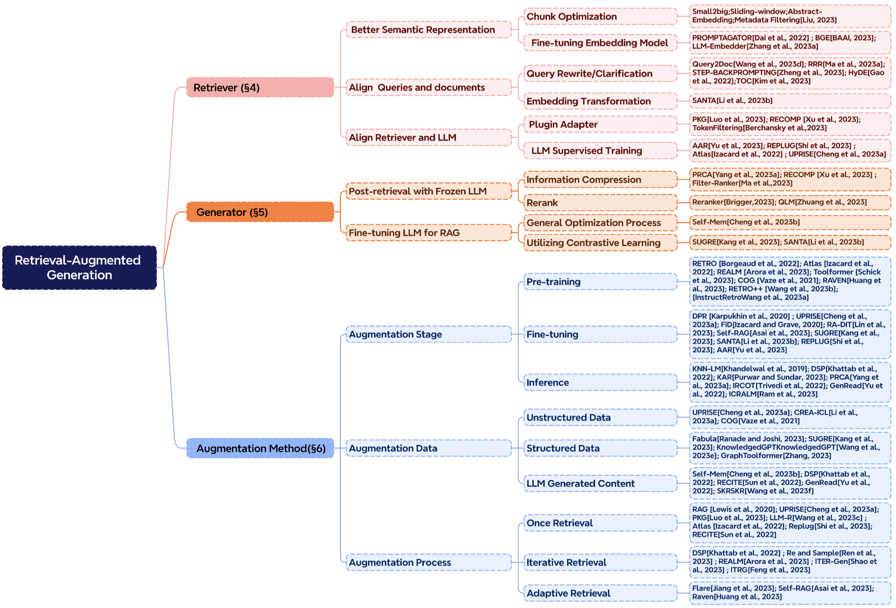

# 大语言模型的检索增强生成技术（RAG）综述

Yunfan Gao 1 , Yun Xiong 2 , Xinyu Gao 2 , Kangxiang Jia 2 , Jinliu Pan 2 , Yuxi Bi 3 , Yi Dai1 , **Jiawei Sun**1 and **Haofen Wang** 1,3 ∗
1 Shanghai Research Institute for Intelligent Autonomous Systems, Tongji University
2 Shanghai Key Laboratory of Data Science, School of Computer Science, Fudan University
3 College of Design and Innovation,Tongji University gaoyunfan1602@gmail.com

## 摘要

大型语言模型（LLMs）虽然能力强大，但在实际应用中还存在一些问题，比如产生不准确的信息、知识更新慢，以及答案的不透明性。检索增强生成（Retrieval-Augmented Generation, RAG）是指在大型语言模型回答问题前，先从外部知识库中检索相关信息的过程。

RAG 被证实可以显著提升答案的准确度，尤其在知识密集型任务中，能有效减少模型生成的错误信息。用户可以通过查看引用的信息来源来核实答案的正确性，这样也增强了对模型输出结果的信任。

此外，RAG 还有助于快速更新知识和引入特定领域的专业知识。

RAG 将大语言模型（LLMs）中的参数化知识与非参数化的外部知识库有效结合，成为了实现大型语言模型的关键方法之一。本文梳理了大语言模型时代 RAG 的发展模式，概括了三种模式：初级 RAG（Naive RAG）、高级 RAG（Advanced RAG）和模块化 RAG（Modular RAG）。接着，文章总结了 RAG 的三大核心组成部分：检索器（retriever）、生成器（generator）和增强方法（augmentation methods），并详细介绍了每个部分的关键技术。此外，文中还探讨了如何评价 RAG 模型的效果，介绍了两种评估 RAG 的方法，并强调了评估过程中的关键指标和能力，同时展示了最新的自动评估框架。最后，文章从纵向优化、横向扩展能力以及 RAG 的技术架构和生态系统三个角度，提出了未来研究的潜在方向。

## 1. 介绍

大语言模型（LLMs）的能力在自然语言处理（NLP）领域达到了前所未有的高度。

包括 OpenAI 在 2020 年和 2023 年发布的 GPT 系列模型 [Brown *et al.*, 2020; OpenAI, 2023]、Touvron *et al.* 在 2023 年提出的 LLama 系列模型，以及 Google 在同年推出的 Gemini 等大型语言模型，在多项评估标准上展现了卓越的语言理解和知识运用能力，甚至在多个领域超过了人类的表现 [Wang *et al.*, 2019; Hendrycks *et al.*, 2020; Srivastava *et al.*, 2022]。

尽管如此，大语言模型仍存在不少需要改进的地方。

大语言模型在某些情况下会产生不准确的信息 [Zhang *et al.*, 2023b]，特别是在面对特定领域或复杂问题时，它们的知识储备可能显得不足 [Kandpal *et al.*, 2023]。举个例子，当用户查询的信息超出了模型的训练数据范围，或者需要获取最新的数据时，大语言模型可能就难以给出正确的答案。这种局限性在将生成式人工智能应用到真实世界的生产环境中尤其成问题，因为仅仅依赖一个不透明的大语言模型往往是不够的。

传统的神经网络通过微调来适应特定的领域或私有信息，这一过程涉及到对知识的参数化处理。虽然这种方法能够带来显著的效果，但它同时也需要耗费大量的计算资源，付出高昂的成本，并且依赖于专业的技术知识，因此在面对不断更新的信息环境时，它的适应性并不理想。参数化知识与非参数化知识各有其用武之地。参数化知识通过训练大语言模型得到，并储存在神经网络的权重里，它代表了模型对训练数据的理解和泛化能力，是生成回答的基础。而非参数化知识则存储在外部的知识库中，比如向量数据库，它不是直接嵌入模型中，而是作为一种可以更新的附加信息。非参数化知识使得大语言模型能够访问并利用最新的或特定领域的信息，从而提升了回答的准确性和相关性。

大语言模型（LLMs）通常将从大量文本资料中学到的知识，以参数的形式储存在模型之中。但是，这种完全基于参数的模型存在一些限制。首先，模型难以完全记住训练资料中的所有知识，尤其是那些不常见或特别具体的信息。

其次，因为模型的参数无法实时更新，所以随着时间的推移，这些基于参数的知识可能会逐渐过时。最后，随着模型参数数量的增加，无论是在训练还是在使用时，所需的计算资源也会随之增加。为了克服这些限制，语言模型可以采用半参数化的策略，即将一个非参数化的语料库数据库与参数化模型结合起来。这种结合的方法称为检索增强生成（Retrieval-Augmented Generation，RAG）。

检索增强生成（Retrieval-Augmented Generation，RAG）这一概念最早由 [Lewis *et al.*, 2020] 在他们的研究中提出。RAG 的设计是将一个预先训练好的信息检索系统与一个预先训练好的序列到序列（seq2seq）生成模型结合起来，并通过端到端的精细调校，使得模型以一种更易于理解和模块化的方式来处理和整合知识。在大型模型成为主流之前，RAG 主要致力于优化整个模型的直接性能。在检索环节，广泛采用了如密集通道检索（Dense Passage Retrieval，DPR）[Karpukhin *et al.*, 2020] 这样的基于向量的密集检索技术，而在生成环节则常常训练规模较小的模型。

由于参数总体较小，检索器和生成器通常需要同步进行端到端训练或者精细调优 [Izacard et al., 2022]。

在像 ChatGPT 这样的大语言模型（LLM）出现之后，生成型语言模型在各种语言任务上展现出了令人印象深刻的性能，从而变得占主导地位 [Bai et al., 2022, OpenAI, 2023, Touvron et al., 2023, Google, 2023]。

然而，大语言模型仍然面临着如幻觉 [Yao et al., 2023, Bang et al., 2023]、知识更新和数据相关问题等挑战。

这影响了大语言模型（LLM）的可靠性，它们在某些关键任务场景中表现不佳，特别是在那些需要获取大量知识的知识密集型任务上，如开放领域的问题解答（Chen 和 Yih, 2020; Reddy 等人, 2019; Kwiatkowski 等人, 2019）和常识性推理（Clark 等人, 2019; Bisk 等人, 2020）。

模型参数所蕴含的知识可能是不完整和有限的。

随后的研究发现，将 RAG 结合到大型模型的情境内学习（In-Context Learning, ICL）过程中，能够有效缓解前述的问题，并且这种改进既显著又容易实施。在模型进行推理时，RAG 能够动态地从外部知识库中提取信息，并利用这些信息来构建答案，这样不仅大幅提升了回答的精确度和相关性，还有效避免了大语言模型中出现的错误信息生成问题。这种技术在大语言模型推出后迅速流行起来，成为了提升聊天机器人性能和增强大语言模型实用性的前沿技术。RAG 通过将确凿的知识与大语言模型训练时的参数分开，巧妙地把生成模型的强大生成能力和信息检索模块的灵活性结合起来，为解决模型内在的知识不完整性问题提供了一个高效的方案。

这篇论文全面梳理了检索增强生成（RAG）的研究方法和未来发展路径，把相关研究归纳为三种主流模式：初级 RAG、高级 RAG 和模块化 RAG。文章进一步详细阐述了 RAG 的三大核心要素：检索、增强和生成，强调了 RAG 的改进方向和技术特点。在探讨增强技术的部分，研究被划分为三个层面：RAG 的增强阶段、数据源和过程。同时，论文还综述了评估体系、适用场景及其他与 RAG 相关的内容。读者通过本文能够对大语言模型及检索增强生成有一个系统的理解，熟悉知识检索增强的发展轨迹和关键技术，从而辨别不同技术的优劣，确定适用的场景，并探讨目前实际应用中的典型案例。值得一提的是，在先前的研究中，Feng 等人系统性地回顾了结合大型模型与知识的方法、应用和未来趋势，主要集中在知识编辑和检索增强方法上。特别值得一提的是，在之前的研究中，Feng 等[2023b] 对结合大语言模型（Large Language Model）和知识的方法、应用及未来趋势进行了系统性的综述，重点是知识编辑和知识检索的增强方法。而 Zhu 等[2023] 则介绍了针对大语言模型的检索系统的最新提升技术，特别是检索系统本身。

同时，Asai 等[2023a] 针对“什么”、“何时”、“如何”等问题，分析并阐释了基于检索的大语言模型（Retrieval-based Language Models）的关键流程。本文与之相比，目的是系统地概括检索增强生成（Retrieval-Augmented Generation, RAG）的全过程，并特别聚焦于通过知识检索来增强大语言模型生成方面的研究。

RAG 算法和模型的发展历程表明，大多数与 RAG 相关的研究都始于 2020 年之后，尤其是在 2022 年 12 月 ChatGPT 发布后，这标志着自然语言处理领域研究进入了以大型模型为主导的新纪元。最初的 RAG 技术很快受到关注，并导致相关研究数量的快速增长。在增强策略方面，自 RAG 概念提出以来，关于预训练和监督式微调阶段的增强研究一直在持续进行。然而，大多数在大语言模型（LLM）时代进行推理阶段强化学习的研究才浮现。这主要是由于高性能的大型模型所伴随的高昂训练成本。研究人员尝试在推理阶段引入 RAG（Retrieval-Augmented Generation）模块，以提高性价比的方式融入外部知识，从而提升模型的生成能力。

在 RAG 数据增强方面的应用初期，研究者们主要关注于非结构化数据，尤其是用于开放式问题解答的场景。随着时间的推移，用于检索的知识来源变得更加多样化，引入高品质数据作为知识库，有效避免了大型模型可能出现的错误信息固化和虚假信息产生。其中，结构化知识的使用尤为关键，知识图谱就是一个典型的例子。近期，自我挖掘知识的方法开始受到重视，这种方法通过利用大语言模型（LLM）自身积累的知识来提高它们的表现。

本论文接下来的章节安排如下：第 2 章介绍 RAG 的基础知识。第 3 章阐述 RAG 的核心方法。第 4 章对 RAG 中的检索机制进行详细分析。第 5 章详细介绍 RAG 中的生成技术。第 6 章详述 RAG 中的数据增强技术。第 7 章讲解 RAG 的评价体系。第 8 章展望 RAG 的未来发展方向。最后，在第 9 章，我们概述本文的主要研究成果。

图 1: 现有 RAG 研究的时间线。这个时间线主要根据发布日期来确定。

## 2. 背景

在本章，我们将阐述 RAG（Retrieval-Augmented Generation）的概念，并比较 RAG 和其他模型优化手段，比如微调（fine-tuning），的不同之处。

### 2.1. RAG 的概念

**定义**：随着技术的进步，RAG（Retrieval-Augmented Generation）的含义也在不断拓展。在大语言模型（Large Language Model）盛行的今天，RAG 特指模型在回答问题或生成文本前，先从庞大的文档库中检索出相关信息。然后，模型利用这些信息来生成答案或文本，以此提升预测结果的品质。RAG 技术使得开发者无需为每个特定任务重新训练整个模型，而是可以直接向模型中添加一个知识库，通过这种方式增加信息输入，从而提高答案的准确度。RAG 技术特别适用于那些需要大量知识的任务。简而言之，RAG 系统主要包含两个关键步骤：

1. 利用编码模型基于问题来检索相关文档，如 BM25、DPR、ColBERT 等[Robertson *et al.*, 2009；Karpukhin *et al.*, 2020；Khattab and Zaharia, 2020]。
2. 生成阶段：系统以检索到的内容为依据，进而生成文本。

### 2.2 RAG 与微调的区别

在大语言模型（Large Language Models, LLMs）的优化过程中，除了 RAG，fine-tuning（微调）也是一个重要的优化技术。

RAG 就像是给模型提供了一本参考书，让它能够针对具体的问题进行信息检索。这种方式适合于模型需要对特定的问题给出答案或处理某些信息检索任务的情境。然而，当涉及到让模型掌握广泛的知识领域或是学习新的语言、格式或风格时，RAG 就不太适用了。

微调就像是帮助学生通过深入学习来掌握并应用知识。

当模型需要模仿特定的结构、风格或格式时，这种方法显得尤为重要。通过微调，可以增强模型的性能，使得与模型的互动变得更流畅、高效。

微调尤其适用于加强模型已有的知识基础，调整或个性化模型的输出结果，并向模型输入复杂的操作指南。但是，微调不适宜于向模型融入新的知识，也不适合那些需要快速迭代以适应新场景的情况。

图 2：RAG 与其他模型优化方法的对比

微调就像是让学生通过深入学习逐渐吸收并掌握知识。这种方法特别适用于模型需要模仿特定结构、风格或格式的情况。微调可以让模型的表现超越未经微调的水平，并且使得与模型的互动更为高效。它特别适合于加强模型已有的知识，调整或个性化输出结果，以及向模型提供复杂的操作指引。然而，微调并不适合用于引入模型尚未掌握的新知识，或者适应那些需要快速迭代新应用场景的情况。RAG 与微调（FT）的具体对比可以参见表 1。

| 特性       | RAG                                                         | 微调                                                 |
| ---------- | ----------------------------------------------------------- | ---------------------------------------------------- |
| 知识更新   | 直接更新检索库，保证信息新鲜，适合快速变化的数据环境。      | 静态数据存储，需重新训练更新知识。                   |
| 外部知识   | 擅长整合外部资源，适合处理文档或其他结构化/非结构化数据库。 | 预训练知识与大语言模型结合，但不适合经常变的数据源。 |
| 数据处理   | 最小化数据处理需求。                                        | 需要高质量数据集，数据限制可能影响性能。             |
| 模型定制   | 重点在信息检索和整合，定制化模型行为有限。                  | 可根据需求调整模型行为和风格，适应特定领域。         |
| 可解释性   | 答案可追溯至数据源，解释性强。                              | 模型反应原因不明显，解释性较弱。                     |
| 计算资源   | 需要资源支持检索和数据库技术，维护数据源更新。              | 需要资源准备训练数据，定义微调目标。                 |
| 延迟要求   | 数据检索可能增加延迟。                                      | 微调模型响应快，延迟低。                             |
| 减少幻觉   | 基于检索证据，不易产生幻觉。                                | 特定域训练可减少幻觉，但面对新输入时可能仍幻觉。     |
| 道德和隐私 | 涉及外部数据时可能有道德隐私问题。                          | 训练数据中的敏感内容可能引发道德隐私问题。           |

表 1: RAG 与微调的特性比较

RAG（Retrieval-Augmented Generation）和模型微调不是不可兼得的对立面，它们实际上可以互为补充，从而在不同的层次上提升模型的功能。在某些特定的场景中，将这两种方法结合起来，可以使模型发挥出最佳的性能。要通过RAG和微调来完全优化模型，可能需要经过多轮的调整和测试，才能得到满意的效果。

现有研究已经证明了相比于其他优化大语言模型的方法，检索增强生成（RAG）具有显著的优势[Shuster et al., 2021; Yasunaga et al., 2022; Wang et al., 2023c; Borgeaud et al., 2022]：

- RAG通过结合外部知识库来提供答案，显著提高了准确性，有效减少了模型生成的不实内容，确保了回答的真实性和可靠性。
- RAG利用先进的检索技术，可以快速获取最新资讯，与传统的大语言模型（LLM）相比，它能更好地保证信息的及时更新和准确性。
- RAG的透明度是其另一大优势。它能够明确指出信息来源，让用户能够直接核实答案的真实性，从而增强了人们对模型输出的信任度。
- RAG还具备高度的定制性。通过构建针对特定领域的文本索引库，它能够为不同行业量身打造知识支持，满足特定需求。
- 在安全性和隐私保护方面，RAG通过在其数据库中设置特定的用户角色和安全控制措施，能够更精确地管理数据的使用权限。与此相对，经过微调的模型可能在数据访问权限的管理上不够明确，存在安全隐患。
- RAG在处理大规模数据集时更加灵活，它不需要对所有参数进行更新，也不必为每次数据变动创建新的训练集，这种方式在成本上更为经济。
- 最后，RAG生成的结果更加可靠。它总是从最新的数据中选取确定性的结果，而经过微调的模型在处理实时更新的数据时可能会产生错误和不一致的信息，这在一定程度上降低了模型的透明度和可信度。

## 3. RAG框架

RAG的研究方法正在不断地发展和完善。本章将重点介绍RAG研究方法的发展历程。我们把它分为三个阶段：**初级RAG、高级RAG和模块化RAG**。虽然早期的RAG在成本上较为经济，性能也超过了传统的大语言模型（LLM），但它还存在一些明显的局限性。为了克服初级RAG存在的问题，研究者们开发出了高级RAG和模块化RAG。这两种新型RAG专门针对初级RAG的局限进行了改进。

### 3.1. 初级 RAG

初级RAG研究方法是在ChatGPT得到广泛应用后不久出现的一种早期研究方法。这种方法包括了一系列传统步骤：建立索引、检索信息和生成回答。

初级RAG也被概括为一个“检索”-“阅读”的框架[Ma *et al.*, 2023a].

**索引**

这一流程主要包括从原始数据源中提取数据，并在离线状态下建立索引。具体地，建立数据索引包含以下几个步骤：

1. **数据索引**：这一步涉及到对原始数据的清理和提取工作，主要是将PDF、HTML、Word、Markdown等多种文件格式统一转换为纯文本格式。
2. **文本分块**：这一步骤将整体文本分割成更小的段落。由于语言模型在处理文本时有一定的上下文长度限制，因此必须将文本切分成尽可能小的单元，以便模型能够有效处理。
3. **文本向量化与索引构建**：这个过程涉及使用语言模型将文本转换为向量形式。这些向量将用于后续的信息检索过程中，帮助计算它们与用户问题向量的相似度。嵌入模型必须具备高速的处理能力，因为当用户提出问题时，系统需要对大量的文本数据进行实时编码，所以模型的参数规模不能过大。完成向量化后，接下来要建立索引，这一步会将文本数据块及其向量表示以键值对的方式存储起来，方便未来快速且频繁地进行搜索。

**检索**

进行检索时，系统会利用与之前相同的文本向量化模型，将用户输入的查询内容转换为向量。然后，系统会计算这个查询向量与语料库中各个文档数据块向量的相似度。根据相似度的高低，系统会选出相似度最高的前K个文档数据块，作为回答当前问题的补充信息来源。

**生成**

在生成阶段，系统会将用户提出的问题和相关的文档资料整合成一个新的输入提示。接着，大语言模型（LLM）将根据这些整合的信息来回答问题。根据不同的任务需求，可以选择让模型仅使用这些特定的信息来回答问题，或者也可以利用模型本身的知识库。此外，如果存在之前的对话历史，这些信息也可以融入到输入提示中，以支持多轮对话的进行。

**Naive RAG 的局限性**

Naive RAG 面临的主要挑战集中在三个方面：检索的准确性、生成回答的质量，以及信息增强的过程。

在检索质量方面，存在的问题包括多个层面。

首要问题是精确度不高，检索到的信息块并非都与查询内容相关联，这可能导致模型产生错误的信息或者断章取义的回答。次要问题是召回率低，即相关的信息块有遗漏，这阻碍了大语言模型（LLM）获取充分的上下文信息来构建答案。还有一个问题是信息过时，数据的重复或陈旧可能导致检索结果不准确。

在回答生成的质量方面，问题同样复杂。模型有时会“臆造”答案，即创造出一个在实际上下文中不存在的回答。另外，模型生成的答案可能与查询问题无关，未能针对性地解决用户的疑问。还有，模型可能产生有害或带有偏见的回答，这种回答可能具有伤害性或冒犯性。

最后，信息增强的过程同样面临着若干挑战。关键在于如何有效地将检索到的文本段落中的上下文与当前的生成任务结合起来。处理不恰当可能会导致生成的文本缺乏连贯性或出现逻辑断层。冗余和重复也是问题之一，特别是当多个检索结果包含相似信息时，在生成阶段可能会出现内容的重复。此外，评估多个检索结果对于生成任务的重要性或相关性也颇具挑战，信息增强的过程需要恰当地衡量每段文本的贡献度。检索结果可能包含不同的写作风格或语调，信息增强过程需调和这些差异，以确保最终输出的一致性。最后，生成模型有时会过度依赖检索到的信息，结果可能只是简单地重复这些内容，而没有提供新的见解或综合了的信息。

### 3.2 高级 RAG

为了弥补 Naive RAG 的不足，高级 RAG（Advanced RAG） 引入了一系列改进措施。在提高检索生成质量方面，Advanced RAG 融合了预检索和检索后处理的技术。针对 Naive RAG 在索引方面的问题，Advanced RAG 采用了滑动窗口技术、更细致的内容分段以及元数据优化等方法来改善索引效率。同时，它还开发了多种方法来提升检索过程的性能。在具体实施上，Advanced RAG 既可以采用流水线式的调整方式，也可以实现端到端的优化。

#### 3.2.1 检索前的过程

**优化数据索引**

优化数据索引的核心目标是提升索引内容的品质。为了实现这一目标，目前主要采用五种策略：提高索引数据的细致程度，改进索引结构的设计，增加元数据信息，进行对齐方式的优化，以及实施混合式检索策略。

1. **提高索引数据的细致程度**：
   预索引优化的主要目的是提升文本的规范化、统一性，并确保信息的准确无误和上下文的充分性，以此来保障 RAG 系统的表现。文本规范化主要是清除无关信息和特殊字符，从而提升检索系统的工作效率。在统一性方面，首要任务是消除实体和术语的含糊不清，并排除重复或不必要的信息，让检索系统能更专注。确保信息的准确性是至关重要的，每条数据的真实性都应当在可能的情况下进行核实。为了使系统能够适应真实世界的互动环境，可以通过添加包含领域专有标注的额外上下文层，并结合用户反馈机制不断更新，来实现上下文的保持。考虑时间因素对上下文信息的重要性，应设计更新机制以便及时更新过时的文档。总体而言，优化索引数据应聚焦于清晰性、上下文关联性和准确性，使得系统既高效又可靠。以下将介绍一些最佳实践。
2. **优化索引结构：**
   优化索引结构可以通过调整数据块大小、修改索引路径和融入图结构信息来实现。调整数据块的过程涉及尽可能地收集相关上下文并减少无关信息的干扰。在搭建 RAG 系统时，数据块的大小决定了其性能，因此不同的评估框架会对比不同大小数据块的效果。
   LlamaIndex2 利用 GPT4 来评估信息的保真度和相关性，而 LLaMA[Touvron *et al.*, 2023] 索引则提供了一种自动评估不同分块方法的功能。多路径索引查询方法与先前的元数据过滤和分块方法紧密相关，并可能涉及到同时在不同的索引中进行查询。可以使用标准索引来处理特定查询，或者使用独立索引根据元数据关键字进行搜索或过滤，比如一个专门的“日期”索引。引入图结构意味着将实体转化为节点，将它们之间的关系转化为边，这种方法特别适用于解决需要多步逻辑推理的问题，因为它能够利用节点之间的关系来提高检索的准确性。采用图数据索引能够使检索结果更加相关。
3. **添加元数据信息：**
   核心任务是将相关的元数据，比如用于筛选的日期和用途等，嵌入到各个数据块中。此外，加入诸如章节和参考文献小节等元数据，也能显著提升检索的效果。在索引被细分为众多数据块后，如何高效检索就成了一个挑战。优先通过元数据进行筛选，可以有效提升检索的效率和准确性。
4. **对齐优化：**
   这一策略主要针对文档间的对齐问题和差异性问题。对齐处理包括设计*假设性问题*，即创造一些与每份文档内容匹配的问题，并将这些问题与文档内容结合起来。这种方法有助于解决文档间的不一致和对齐问题。
5. **混合检索：**
   这种策略的优点在于它结合了多种检索技术的优势。通过智能集成关键词搜索、语义搜索以及向量搜索等多种方法，混合检索能够适配各类查询需求和信息检索场景，从而始终能够检索到最贴切、信息量最丰富的结果。作为检索策略的强大补充，混合检索显著提升了 RAG (Retrieval-Augmented Generation) 管道的整体检索性能。

#### 3.2.2 向量嵌入

**微调向量嵌入**

对嵌入模型进行微调对 RAG 的效果至关重要。微调的核心目标是让检索到的内容与用户的查询请求更加吻合。微调嵌入的角色可以比作是在说话之前对听觉进行调校，以确保我们所听取的信息能够更好地指导我们的言语表达。在微调词嵌入技术时，通常有两种方法：一是调整嵌入以适应特定领域的语境，二是优化检索步骤。尤其在那些涉及不断更新或稀有术语的专业领域，这些定制化的词嵌入技术能显著提升信息检索的准确度。北京航空航天大学智能科学研究院（BAAI）在 2023 年开发的 BGE 嵌入模型，是一个经过精细调校、性能卓越的模型，例如 BAAI 研究的 BGE-large-EN 版本。为了生成用于微调 BGE 模型的训练数据，我们可以先利用 gpt-3.5-turbo 这类大语言模型（LLM）来根据文档片段提出问题，这些问题及其对应的答案（即文档片段）将作为微调过程中的训练对。

**动态词向量嵌入**：
动态词嵌入会根据单词所处的语境进行调整，这一点与为每个单词分配固定向量的静态词嵌入截然不同。举个例子，在 Transformer 类型的模型如 BERT 中，一个单词的嵌入向量会因其周围的单词而有所不同。

研究显示，在 OpenAI 的 text-embedding-ada-002 模型（4）中，特别是当文本长度不超过 5 个 Token 时，观察到了异常高的余弦相似度结果。

理想情况下，词嵌入应尽可能多地包含上下文信息，以确保产生可靠的结果。OpenAI 的 embeddings-ada-02 基于大语言模型（如 GPT）的原理，相较于静态词嵌入模型，它能够捕捉更多层次的上下文信息。尽管在理解上下文方面具有明显优势，但与最新的全功能语言模型（如 GPT-4）相比，它对上下文的敏感度可能还有所不足。

#### 3.2.3 检索后的处理过程

在从数据库中检索到重要的上下文信息后，将这些信息与查询请求结合起来输入到大语言模型（LLM）中，这个过程充满挑战。如果试图一次性将所有相关文档呈现给大语言模型，可能会超出其处理的上下文窗口限制。

简单地将众多文档拼接成一个长串的检索提示并不高效，这样做会增加无关信息，分散大语言模型（LLM）对关键内容的注意力。因此，对检索到的内容进行进一步加工处理显得尤为必要。

- **ReRank 重新排序:**

  一种直观的解决方案是重新排序，将最关键的信息置于输入提示的最前或最后。这种方法已在 LlamaIndex、LangChain 和 HayStack 等框架中得到应用 [Blagojevi, 2023]。举个例子，多样性排名器 (Diversity Ranker) 会优先考虑文档的差异性来进行重新排序，而 LostInTheMiddleRanker 则是在排列结果中交替地把最优文档放在最前面和最后面。与此同时，为了应对解析基于向量的搜索模拟在语义相似度上的挑战，方法如 cohereAI 重排 [Cohere, 2023]、bgererank5 或 LongLLMLingua [Jiang et al., 2023a] 会重新估算查询内容与相关文本之间的语义相似性。
- **提示词压缩**
  研究指出，检索文档中的噪声会对 RAG (Retrieval-Augmented Generation) 性能造成不良影响。在处理的后期阶段，工作的焦点是压缩那些不相关的内容，凸显出关键段落，并缩短整体的上下文长度。方法如 Selective Context [Litman *et al.*, 2020] 和 LLMLingua [Anderson *et al.*, 2022] 利用小型的大语言模型 (LLM) 来计算提示信息之间的相互信息量或者复杂度，从而评估各个元素的重要性。

  然而，这些方法在处理 RAG (Retrieval-Augmented Generation) 或者涉及大量上下文信息的场景时，可能会漏掉一些关键信息。

  为了应对这一问题，Recomp [Xu *et al.*, 2023a] 提出了一种新的解决方案，即在不同层次上训练压缩算法，以更细致地处理信息。在处理大量上下文信息的情况下，[Xu *et al.*, 2023b] 采用了分解和压缩的方法。另一方面，“在记忆迷宫中行走” [Chen *et al.*, 2023a] 则构建了一个分层的摘要树结构，以此提升大语言模型（LLM）对关键信息的捕捉能力。

#### 3.2.4 RAG 检索流程优化

提升检索流程的效率和信息品质是优化 RAG（Retrieval-Augmented Generation）系统的关键目标。目前的研究重点在于智能地融合不同的搜索技术，改进检索的各个步骤，采纳认知回溯技术，灵活运用多种查询策略，并且有效利用数据嵌入的相似性分析。这些集体的努力旨在RAG检索过程中，找到效率和上下文信息丰富性之间的最佳平衡点。

- **混合搜索探索：**

  RAG 系统通过智能结合关键词搜索、语义搜索以及向量搜索等多样技术，发挥各自的优势。这种多元化的搜索方法让 RAG 系统能够针对不同的查询需求和信息类型，始终检索到最为相关且信息丰富的结果。混合搜索作为一种强有力的策略，它有效提升了 RAG 检索流程的整体表现。
- **递归检索：**

  RAG 系统中的另一种提升检索效率的强效方法是采用递归检索和高级查询引擎。递归检索的策略是在最初的检索阶段先获取较小的文档片段，这样做是为了抓住文档的核心语义。随着检索过程的深入，更大的文档块，携带更丰富的上下文信息，随后被提供给语言模型（LM）。这个分阶段的检索方法旨在实现检索效率与获取信息丰富度之间的最佳平衡。
- **StepBack-prompt 方法：**

  在 RAG 流程中融合 StepBack-prompt 方法[Zheng *et al.*, 2023]，这一策略激励大语言模型（LLM）跳出具体案例，转而对更广泛的基本概念或原理进行思考。实验发现，通过加入这种退回上一步的提示词，各类需要深度推理的难题在效果上都得到了显著的提升，这证明了 StepBack-prompt 与 RAG 的天然兼容性。无论是在生成退回上一步的提示词的答案，还是在最终的问答过程中都可以得到应用。
- **子查询策略：**

  在不同的应用场景中，我们可以采取多种查询策略。这包括利用 LlamaIndex 等框架提供的查询引擎，执行树形结构的查询，使用向量式查询，或者进行基础的顺序数据块查询。
- **HyDE:**

  该方法的核心思想是，生成的答案在嵌入空间中的距离可能比直接查询的结果更为接近。通过大语言模型（LLM），HyDE 创造出一个假设的答案文档来响应查询，然后将这个文档进行嵌入处理，并利用这一嵌入结果来寻找与之相似的真实文档。不同于直接基于查询内容寻找嵌入的相似性，这一策略更注重答案之间的嵌入匹配度。但是，这种方法并不总是能够得到理想的结果，尤其是当语言模型对讨论的主题不够熟悉时，可能会增加产生错误答案的风险。

### 3.3 模块化 RAG

模块化 RAG 结构颠覆了传统的 Naive RAG 框架，该框架包括索引、检索和生成等步骤，为整个流程带来了更多的多样性和灵活性。它不仅融合了多种方法来增强功能模块，比如在相似性检索中融入搜索模块，并在检索器中采用微调策略[Lin *et al.*, 2023]。还有，面对特定的问题，人们开发了重构后的 RAG 模块[Yu *et al.*, 2022]，以及迭代方法如[Shao *et al.*, 2023]。模块化 RAG 范式正逐渐成为 RAG 领域的新标准，它支持串联式的处理流程或是跨多个模块的端到端训练方式。这三种 RAG 范式的对比展示在 图 3。

图 3: 三种 RAG 范式的对比

#### 3.3.1 新模块

- **搜索模块**:

  此模块改进了 Naive/Advanced RAG 中仅基于查询和语料库相似性的检索方式。它专为特定场景设计，能够利用大语言模型（LLM）生成的代码、查询语言（如 SQL、Cypher）或其他定制化工具，在流程中对（额外的）语料库进行直接搜索。其搜索数据源涵盖了从搜索引擎、文本数据、表格数据到知识图谱等多种类型[Wang *et al.*, 2023c]。
- **记忆模块:**

  该模块利用了大语言模型（LLM）本身的记忆能力来引导信息检索。它通过找出与当前输入最匹配的记忆来实现这一点。Self-mem [Cheng *et al.*, 2023b] 采用了迭代方式，通过检索增强生成器创建了一个无限的记忆库，这个库结合了“原始问题”与“对偶问题”的概念。这样的检索增强生成模型能够用自身的输出来进一步优化自己，从而使生成的文本更贴近推理过程中的实际数据分布，而非仅仅依赖于训练数据[Wang *et al.*, 2022a]。
- **补充生成模块:**

  在检索的内容中，经常会遇到冗余和噪声问题。为了解决这一问题，增强生成模块采用了大语言模型（LLM）生成必要的上下文，而不是直接从数据源进行检索[Yu *et al.*, 2022]。相较于直接检索，大语言模型生成的内容更可能含有相关的信息。
- **任务适配模块:**

  该模块致力于改造 RAG，使其能够适应多种下游任务。UPRISE[Cheng *et al.*, 2023a] 能够自动地从一个预先构建好的数据池中，为各种零样本（zero-shot）任务输入挑选合适的提示语，从而提升任务和模型间的通用性。PROMPTAGATOR[Dai *et al.*, 2022] 则使用大语言模型作为少样本（few-shot）的查询生成工具，依据生成的数据来构建针对特定任务的检索器。借助大语言模型的泛化能力，PROMPTAGATOR 能够仅凭几个示例就实现特定任务的端到端检索器的创建。
- **查询文本对齐增强模块**:
  在改进检索式回答生成器（RAG）的过程中，如何精确地将用户的查询和大量文本资料对齐，一直是一个至关重要的挑战。在RAG技术不断进化的今天，研究者们发现，为检索系统加入一个可以训练的适配器模块，能够显著改善这一对齐问题。PRCA[Yang et al., 2023b] 通过强化学习培养了一个上下文适配器，它在检索和生成环节之间，根据大语言模型（LLM）给出的反馈进行自我优化。它通过在有标签的自回归策略下的强化学习阶段内追求最大奖励来提升检索结果的相关性。AAR [Yu *et al.*, 2023b] 提出了一个能够学习已知 LLM 的语言模型偏好的通用插件，这样的插件可以帮助那些未知或者没有经过特定微调的 LLM 提升性能。RRR [Ma *et al.*, 2023a] 则设计了一个基于强化学习的查询重写模块，目的是为了更好地将用户的查询与语料库中的文档匹配起来。
- **验证模块:**

  在现实世界的场景中，我们无法始终保证检索到的信息是准确无误的。获取到的不相关信息可能会让大语言模型 (LLM) 产生误判。因此，可以在文档检索之后加入一个额外的验证模块，用以评估检索到的文档与查询请求之间的相关性。这样做可以提升由 [Yuet al., 2023a]提出的 RAG 系统的稳健性。

#### 3.3.2 新模式

模块化RAG 的结构设计具有高度灵活性，它可以根据具体问题的需要来更换或重组其内部的模块。对于初级RAG，它包括了检索和生成这两个核心模块（在某些文献中分别被称作“阅读”或“合成”阶段）。模块化RAG的框架能够根据不同的需求进行调整，具有很强的适应能力。当前的研究主要集中在两种模块组织方式上，包括增加或更换模块，以及优化模块间的工作流程。

- **添加或更换模块**：

  通过添加或更换模块，我们可以在保持原有的检索-阅读框架不变的基础上，引入新的模块以提升系统的某些特定功能。例如，RRR[Ma *et al.*, 2023a] 提出了一个包含重写、检索、阅读三个环节的过程，它通过将大语言模型（LLM）的表现作为奖励，来优化重写模块在强化学习中的效果。这样一来，重写模块就能够调整检索的查询条件，从而提升阅读环节在后续任务中的表现。同理，在 Generate-Read[Yu *et al.*, 2022] 的方法中，可以根据需要选择性地更换模块，比如用大语言模型的生成模块来取代原本的检索模块。

  另一个例子是 Recite-Read [Sun *et al.*, 2022]，它把传统的外部信息检索转变为直接从模型本身的权重中提取信息。这个过程首先需要大语言模型记忆与任务紧密相关的信息，然后生成答案，以应对那些需要大量专业知识的自然语言处理任务。
- **调整模块间的流转过程**

  在调整不同模块间的流转过程中，着重于提升语言模型与检索模型之间的交互能力。DSP[Khattab *et al.*, 2022] 提出了一种展示-搜索-预测的新框架，这个框架把学习上下文的系统当作一个明确的程序来运行，而不仅仅是作为完成任务的一个简单指令，这样做能更好地应对那些需要大量知识的任务。

  ITER-RETGEN [Shao *et al.*, 2023] 则是通过生成内容来引导信息检索，它在检索-阅读-检索-阅读的流程中不断循环，交替进行“检索增强的内容生成”和“内容生成增强的检索”，以此来提高效果。Self-RAG[Asai *et al.*, 2023b] 遵循一个决策-检索-反思-阅读的流程，并引入了一个能够主动做出判断的模块。这种既自适应又多样化的方法使得我们能够在模块化的 RAG 框架中灵活地组织和调整各个模块。

## 4. 检索器 Retriver

在 RAG 架构中，“R”代表着检索，它的任务是在 RAG 流程中从广阔的知识库里找出最相关的前 k 篇文档。但是，开发一个优质的检索器是一项复杂的任务。在这一章节，我们将围绕三个核心问题展开讨论：1) 我们如何获得精确的语义表征？2) 我们如何确保查询的语义与文档的语义能够正确匹配？3) 我们如何调整检索器的结果，使其符合大语言模型的使用偏好？

### 4.1 如何获得精确的语义表征？

在 RAG 系统中，语义空间是一个多维的空间，我们在这个空间里对问题和文档进行定位和分析。

进行信息检索时，我们会在这个多维的语义空间内进行评估。如果我们对语义的捕捉不够精确，那么对于 RAG 系统的运作就会产生严重的负面影响。接下来的部分，我们将介绍两种有效的方法，帮助我们构建出一个能够准确反映语义的空间。

#### 4.1.1 优化分块（Chunk）

在处理外部文档时，首先要做的是将文档分割成若干小块，以此来提取更精细的特征信息。接着，这些文本小块会被转化为嵌入向量。

但是，如果文本块划分得太大或太小，都可能不利于获取最佳效果。因此，对于语料库中的文档，找出最合适的文本块大小是至关重要的，这直接关系到搜索结果的精确度和相关性。

在选择文本分块的策略时，我们需要考虑多个重要因素：首先是待索引内容的特点，比如内容的长度和主题等；其次是我们采用的嵌入模型以及它对文本块大小的要求；还有用户可能提出的问题的长度和复杂程度，以及如何在特定的应用场景中利用搜索结果。例如，对于篇幅较长或较短的文章，我们需要选择不同的分块方式。不同的嵌入模型对文本块的大小也有不同的适应性，例如，sentence-transformer 更适合处理单个句子，而 text-embedding-ada-002 则更适合处理包含 256 或 512 个 Token 的文本块。此外，用户输入的问题文本的长度和复杂度，以及应用程序是否需要语义搜索或问答服务，也会影响我们如何选择分块策略。这些选择可能需要根据您使用的大语言模型能处理的 Token 数量上限来调整。实际上，要实现精确的查询结果，我们需要灵活运用多种分块策略，因为没有一种策略是最好的，只有最适合当前情况的策略。

Small2big 技术在搜索时先用小块文本快速定位信息，然后再用更大的文本块帮助语言模型深入理解和处理。Abstract embedding 技术通过仅对文档的摘要进行快速的Top K检索（Top K retrieval），就能够提供整个文档的大致内容。Metadata Filtering 技术则通过文档的附加信息，比如作者、发布日期等，来帮助筛选出更相关的文档。Graph Indexing 技术通过将文本中的关键实体和它们的关系转化为图中的节点和边，从而在处理需要多步逻辑推理的问题时，大大提升了搜索的相关性。这些技术的结合不仅提升了检索的准确性，也优化了 RAG（Retrieval-Augmented Generation，检索增强型生成）模型的整体性能。

#### 4.1.2 微调嵌入模型

在得到适当大小的文本块（Chunks）之后，我们需要使用嵌入模型（Embedding model）将这些文本块和查询语句映射到语义空间，这一步骤对于确保模型能够有效捕捉和表达语料库的含义至关重要。目前，市面上已经有了一些表现出色的嵌入模型，比如 UAE[AngIE, 2023]、Voyage[VoyageAI, 2023] 和 BGE[BAAI, 2023] 等，它们在大量文本数据上接受过预训练，能够捕捉丰富的语义信息。然而，当这些模型被用于特定的领域时，它们可能无法准确捕捉该领域内的专业知识。因此，对嵌入模型进行任务特定的微调变得极为重要，这样可以确保模型更好地理解用户的查询，并与相关内容建立精确的联系。未经过微调的模型可能无法完全满足特定任务的要求，因此针对下游应用对嵌入模型进行细致调整是必不可少的。

在嵌入模型的微调方法中，我们主要采用两种基本策略。

1. **领域知识微调**

为了使嵌入模型能够准确理解特定行业或领域的专业信息，我们必须构建该领域的专有数据集，以此来对模型进行精细的调整。

微调嵌入模型的过程与传统大语言模型的微调有所不同，这种差异主要体现在它们所依赖的数据集类型上。在目前微调嵌入模型的主流方法中，所使用的数据集包括三个主要部分：查询（Queries）、语料库（Corpus）以及相关文档（Relevant Docs）。嵌入模型的任务是根据用户的查询在语料库中寻找并匹配相关的文档。而这些查询对应的相关文档是否能够被模型准确检索出来，作为衡量模型性能的关键指标。

在构建数据集、微调模型以及进行评估的过程中，每一个环节都可能遇到各种挑战。在LlamaIndex [Liu, 2023]的研究中，开发了一系列专门用于嵌入模型微调的关键类和函数，这些工具大大简化了整个微调流程。只要我们准备好包含领域知识的语料库，并应用LlamaIndex提供的方法，就能够方便地得到一个为特定领域量身定制的嵌入模型。

2. **针对下游任务进行微调**

对于下游任务，微调嵌入模型以适配这些任务也是至关重要的。在应用RAG（Retrieval-Augmented Generation）到下游任务时，一些研究通过利用大语言模型（LLM）的强大功能来优化嵌入模型。例如，PROMPTAGATOR [Dai *et al.*, 2022] 使用LLM作为少样本查询生成器，根据生成的查询创建了适应特定任务的检索器，这样做有效地减轻了在数据匮乏领域中进行监督式微调的难题。LLM-Embedder [Zhang *et al.*, 2023a] 则采用LLM为来自多个下游任务的数据输出奖励值，通过数据集的硬性标注和LLM提供的软性奖励，结合两种监督信号来精细调整检索器。

通过领域知识的注入及下游任务的微调，语义表示得到了一定程度的提升。但是，这种训练方法得到的检索器并不总是能直接为大语言模型（LLM）带来直观的帮助。为此，研究人员进行了一些工作，他们直接使用来自LLM的反馈信号来监督嵌入模型的微调过程。（相关内容将在第4.4节详细介绍）

### 4.2 如何匹配查询与文档的语义空间

在 RAG 应用中，有些检索器采用同一嵌入模型对查询和文档进行编码，而另一些则使用两个不同的模型来分别处理。不仅如此，用户的初始查询往往表达不清或语义信息不足。为了解决这个问题，使用户的查询与文档在语义上达到一致显得尤为重要。本节将介绍两种关键技术，它们是实现这一目标的重要手段。

1. **查询改写**

查询改写是最直接的方法来使查询与文档的语义保持一致。

正如在 Query2Doc [Wang *et al.*, 2023b] 和 ITER-RETGEN [Shao *et al.*, 2023] 所述，可以利用大语言模型（LLM）的生成能力，指导模型生成一个与查询相关的伪文档，并将原始查询与这个伪文档结合起来，以此形成一个新的、更加丰富的查询。

在 HyDE [Gao *et al.*, 2022] 的研究中，查询向量是通过文本指示器来构建的，利用这些指示器来生成一个虚构但相关的文档。这个文档虽然可能实际上并不存在，但它的作用在于捕获与查询相关的模式。

在[Ma et al., 2023a]提出的RRR研究中，他们开发了一种新的框架，这个框架改变了传统的信息检索和处理顺序，着重于改写搜索查询。具体来说，这个方法先利用一个大语言模型来创建搜索请求，然后通过网络搜索引擎来寻找相关信息，并且最终采用一个更小型的语言模型来对搜索请求进行优化，以辅助已经设定好的大型语言模型。

而在[Zheng et al., 2023]的STEP-BACKPROMPTING研究中，他们展示了一种方法，能让大语言模型执行抽象的逻辑推理，从而识别出核心概念和规则，并使用这些概念和规则来指导信息的检索。

最后，所谓的多查询检索方法，是指使用大语言模型来制定一系列的搜索请求，这些搜索请求可以同时进行，其结果将被集中处理。这种方法对于那些需要解决多个相关子问题才能解答的复杂问题特别有效。

2. **嵌入转换**

在处理数据时，我们不仅可以像重写查询这样的粗颗粒度调整方法，还需要更微观、更精细的技术来优化嵌入式操作。在 LlamaIndex[Liu, 2023] 研究中，研究者提出了一种方案：在查询编码器后加入一个适配器模块，通过细致调整这个模块，可以改进查询嵌入的效果，使之转换到一个更适合完成特定任务的隐含空间。特别是当我们处理的查询内容与外部文档的格式不一致时，比如一个是非结构化的查询，而另一个是结构化的文档，确保两者之间能够有效对齐就显得尤为关键。

SANTA[Li *et al.*, 2023d] 研究提出了两种新的预训练方法，旨在让检索系统能够理解和处理结构化的信息：1) 利用结构化数据与非结构化数据之间天然的对应关系，通过对比学习的方式进行专门的结构化信息预训练。2) 掩码实体预测法，这个方法通过设计一种针对实体的掩码策略，挑战大语言模型去预测和填补这些被隐藏的实体信息。

## 4.3 如何使检索结果与大语言模型的需求相匹配

在 RAG 流程中，我们可以采用一些先进的技术来提升检索的准确度，但这并不总能提高 RAG 的最终效果，因为有时候检索出的文档并不符合大语言模型的实际需求。为了解决这个问题，本节将介绍两种策略，旨在使检索器产出的结果更好地符合大语言模型的偏好。

1. **用大语言模型监督向量嵌入模型进行训练**

   许多研究通过分析大语言模型的反馈来改进嵌入式模型的性能。AAR[Yuet al., 2023b]利用编解码器结构的语言模型，为已经预训练好的检索系统提供指导性的反馈。通过评估语言模型更倾向于哪些文档，结合 FiD（Fusion-in-Decoder）的交叉注意力得分，研究人员对检索系统进行了进一步的微调，使用了硬性负样本采样和传统的交叉熵损失函数。经过这样的微调，检索系统能够更好地服务于新的大语言模型，并在特定任务上取得更佳的表现。检索器的训练损失函数定义如下：

   $$
   \zeta=\sum_{q}\sum_{d^{+}\,\in\,D^{a}+}\sum_{d^{-}\,\in\,D^{-}}l\left(f\left( q,d^{+}\right),f\left(q,d^{-}\right)\right) \tag{1}
   $$

   其中 ${D^{a}}^{+}$ 代表在检索到的文档中，大语言模型更倾向的那些文档，而 ${D^{a}}^{-}$ 则代表那些不受偏好的文档。$l$ 表示的是常用的交叉熵损失函数，用于评估预测结果与实际情况的一致性。最终，研究建议，大语言模型在处理文档时，可能会更偏好那些易于阅读的文档，而不是那些信息量更大的文档。

   REPLUG[Shiet al., 2023]利用检索系统和大语言模型计算检索出的文档的可能性分布，并通过计算 KL 散度来进行监督式训练。这种训练方法简洁有效，它通过将语言模型的输出作为指导信号来提升检索系统的性能，避免了使用复杂的交叉注意力机制。检索器的训练损失函数表述如下：

   $$
   \xi=\frac{1}{|D|}\sum_{x\in D}KL\left(P_{R}\left(d|x\right)||Q_{LM}\left(d|x,y\right)\right) \tag{2}
   $$

   其中 D 代表了一系列输入的语境集合，$P_{R}$ 表示文档被检索出的可能性，而 $ Q_{LM} $ 则是语言模型评估每个文档相关性的可能性。

   UPRISE[Cheng *et al.*, 2023a] 也采用了冻结的大语言模型来微调其提示检索器的性能。

   然而，无论是语言模型还是检索器，它们都以提示和输入的配对形式作为输入，并利用大语言模型评估出的得分来指导检索器的训练，这种做法相当于直接利用大语言模型对数据集进行打标签的工作。

   Atlas[Izacard *et al.*, 2022] 提出了四种提升监督式嵌入模型性能的方法。在这些方法中，注意力蒸馏法是通过模仿语言模型在生成答案时所关注的信息点来进行的。而 EMDR2 则采用了期望最大化算法，通过把检索到的文档当作隐藏的变量来进行训练。

   困惑度蒸馏法直接采用模型生成词汇的困惑度（即模型对词汇出现概率的预测准确度）作为衡量标准进行训练。LOOP 引入了一种新的损失函数，这个函数基于移除文档后对模型预测结果的影响来定义，提供了一种有效的训练方法，以便模型更好地针对特定任务进行优化。
2. **接入一个适配器模块**

   但是，由于需要通过 API 来实现嵌入功能或本地计算资源可能不足等问题，对嵌入模型进行微调可能会遇到一些难题。

   因此，有些研究选择外接一个适配器来实现模型的调整。PRCA[Yang *et al.*, 2023b] 通过两个阶段来训练这个适配器：一是上下文提取阶段，用于捕捉关键信息；二是奖励驱动阶段，通过奖励机制来优化适配器的表现。适配器最终通过一个以 Token 为基础的自回归策略来提升检索器的输出效果。

   TokenFiltering[Berchansky *et al.*, 2023] 方法通过计算交叉注意力分数来筛选出最重要的输入词汇，从而有效地进行词汇过滤。RECOMP[Xu *et al.*, 2023a] 提出了抽取式和生成式的压缩技术，它们通过挑选出与查询最相关的句子或者合成文档的关键信息来生成摘要，实现了针对多文档查询的焦点摘要。此外，PKG[Luo *et al.*, 2023] 提出了一种创新方法，它通过指令性的微调过程将知识融入到一个透明的模型中，并且直接用这种方法取代了传统的检索模块，使得模型能够直接根据查询输出相关文档。

## 5 生成器 Generator

RAG 系统中的另一个关键部分是生成器，它的职责是把检索到的信息转化为自然流畅的文本。生成器的设计受到了传统大语言模型的影响，但与一般的生成模型不同，RAG 的生成器通过结合检索到的信息来提升文本的准确性和相关性。在 RAG 体系中，生成器接收的输入信息不仅包括传统的上下文信息，还有检索器找到的相关文本片段。这让生成器能更深入地理解提问的背景，并生成更加丰富的回答。同时，生成器会参考检索到的文本来确保其生成的内容与检索到的信息保持一致。输入数据的多样化促使我们在生成阶段采取了一系列有针对性的措施，以便更好地调整大模型以适应来自查询和文档的数据。接下来，我们会详细介绍生成器，包括后检索处理和微调等方面。

### 5.1 后检索处理如何改善检索结果？

在未经特定任务微调的大语言模型领域，大多数研究依靠诸如 GPT-4 [OpenAI, 2023] 这样的知名大语言模型，借助其强大的内置知识库来实现对文档知识的深入检索。尽管如此，这些模型仍然存在一些问题，比如对上下文长度的限制和对重复信息的过度敏感。为了解决这些问题，一些研究致力于后检索处理。后检索处理是指在检索阶段之后，对检索器从庞大的文档数据库中提取的相关信息进行进一步的处理、筛选或优化。这一过程的主要目的是为了提升检索结果的品质，更好地适应用户的需求或者为后续的任务打下基础。具体来说，后检索处理包括了对检索到的文档进行信息压缩和结果重排序等操作。

**信息浓缩**
即便检索器能够从广阔的知识库中检索到相关信息，我们还是需要面对如何处理检索得到的大量文档信息的问题。一些研究尝试通过扩展大语言模型的处理上下文长度来应对这一挑战，但现有的大型模型依旧受限于上下文长度。因此，在特定情况下，对信息进行浓缩是必不可少的。总的来说，信息浓缩的重要性主要表现在减少无关信息的干扰、适应上下文长度的限制，以及提升文本生成的效果上。

PRCA [Yang *et al.*, 2023b] 通过培训一个专门的信息抽取器来应对这一挑战。在抽取上下文的阶段，对于给定的输入文本 S*input*，该系统能够生成一个输出序列 C*extracted*，这个序列代表了从输入文档中精炼出的核心内容。训练的目标是让这个抽取出的上下文 C*extracted* 尽可能地接近实际的上下文 C*truth*。他们所使用的损失函数旨在衡量两者之间的差异，具体如下：

$$
minL(\theta)=-\frac{1}{N}\sum_{i=1}^{N}C_{truth}^{(i)}log(f.(S_{input}^{(i)}; \theta)) \tag{3}
$$

其中 $f$ 代表信息抽取器，$\theta$ 是该抽取器的参数。类似地， RECOMP[Xuet al., 2023a] 利用对比学习的方法训练了一个信息凝练器。对于每个训练样本，都会有一个正面样本和五个反面样本。在这个过程中，编码器通过对比损失函数 [Karpukhinet al., 2020]来进行优化训练。具体的优化目标包括：

$$
-log\frac{e^{sim(x_{i},p_{i})}}{sim(x_{i},p_{i})+\sum_{n_{j}\in N_{i}}e^{sim(x_ {i},p_{i})}} \tag{4}
$$

其中，$x_{i}$ 代表训练数据，$p_{i}$ 为正面样本，$n_{j}$ 为负面样本，$sim(x,y)$ 的功能是计算 $x$ 和 $y$ 之间的相似度。另一个研究团队决定进一步减少文档的数量，目的是通过缩小检索文档的范围来提升模型回答问题的准确度。[Ma *et al.*, 2023b] 提出了一种新的“过滤-排序”模式，该模式融合了大语言模型（LLMs）和小语言模型（SLMs）的优点。在这种模式下，SLMs 起到过滤的作用，而 LLMs 则负责对筛选后的内容进行重新排序。研究显示，通过让 LLMs 对 SLMs 筛选出的复杂样本进行重排，能够在多个信息提取任务上取得显著的成效。

**重新排序 ReRanking**

重排序模型的核心作用体现在它能够改进搜索引擎检索出的文档集合的质量。

当引入更多的相关信息时，大语言模型（LLMs）可能会出现性能下降的问题。为了解决这一难题，重排序方法被证明是一种有效的策略。其核心理念是对文档进行重新组织，确保最关键的信息排在最前面，这样做可以将处理的文档数量控制在一个合理的范围内。这种方法不仅能够克服在信息检索过程中可能出现的信息过载问题，还能够显著提升检索的效率和系统的反应速度[Zhuang *et al.*, 2023]。

重排序过程中引入的上下文压缩技术，其目标是确保仅根据用户的查询上下文来提供相关信息。这种策略的双重价值在于，它不仅减少了每个文档中不必要的信息量，还筛选出了整个文档集中的关键内容，使得检索结果更加聚焦于用户最需要的信息。从而，重排序模型在信息检索的全过程中起到了关键的优化与提炼作用，它为后续的大语言模型（LLMs）处理环节提供了更为精确有效的数据输入。

## 5.2 如何微调生成器？

在 RAG（检索增强的生成器）模型中，对生成器部分进行优化至关重要。生成器的职责是将检索到的信息转化为相关的文本，这一过程决定了模型输出的质量。优化生成器的主要目的是为了保证输出的文本不仅通顺自然，而且能够充分利用检索到的文档内容，以便更准确地回应用户的搜索意图。

在常规的大语言模型（LLM）生成任务中，我们通常以一个查询作为输入。而在 RAG 模型中，输入的内容更为丰富，不仅包括用户的查询，还包含了检索器返回的各类文档（无论是有结构的还是无结构的）。这些额外的信息可能会显著影响模型的理解能力，尤其是在模型规模较小时。因此，在这种场景下，对模型进行细致的微调，使其能够处理“查询加上检索文档”的输入组合，变得格外关键。通常，在将这些输入提供给经过微调的模型之前，需要对检索器返回的文档进行一系列的后处理工作。需要指出的是，RAG 模型中对生成器进行微调的方法，在本质上与为大语言模型（LLMs）进行的常规微调是相似的。

接下来，我们将简要介绍一些具有代表性的研究，这些研究涉及不同格式的数据处理和优化方法。

**General Optimization Process**

优化过程通常指的是使用含有输入和输出配对的训练数据，这一过程旨在培养模型根据输入 x 产生对应输出 y 的能力。

在 Self-mem[Cheng *et al.*, 2023b] 的研究中，他们采用了一种较为传统的训练方法。具体来说，系统会根据给定的输入 x 检索到相关的文档 z，并在文章中只选择最相关的一个（Top-1）。通过将输入 x 与文档 z 结合，模型进而生成输出 y。

本文采用了两种常用的微调方法，分别是 Joint-Encoder [Arora *et al.*, 2023; Wang *et al.*, 2022b; Lewis *et al.*, 2020] 和 Dual-Encoder [Xia *et al.*, 2019; Cai *et al.*, 2021; Cheng *et al.*, 2022]。

在 Joint-Encoder 方法中，研究者使用了一种标准的编解码模型。这个模型首先通过编码器处理输入信息，然后解码器利用注意力机制，将编码得到的信息组合起来，逐步生成文本片段（Token），这个过程是连续且自我依赖的。

$$
H = Encoder(x[SEP]m) (5)
$$

$$
h^i = Decoder(CrossAttn(H), y < i) (6)
$$

$$
PG_ξ(.|x, y < i) = Softmax(h^i)(7)
$$

在 Dual-Encoder 结构中，系统配置了两个独立的编码器，一个用于处理输入的查询和上下文信息，另一个用于处理文档内容。接着，解码器会依次对这些输出信息进行一种称为双向交叉注意力的高级分析。研究者选用了 Transformer [Vaswani *et al.*, 2017] 作为这两种结构的基础，并且通过优化一个称为负对数似然（NLL）的数学函数来提升模型的性能。

$$
Hx = SourceEncoder(x)Hm = MemoryEncoder(x) (8)
$$

$$
h^i = Decoder(CrossAttn(Hx, Hm), y < i) (9)
$$

$$
Lnll = −  \sum\limits_{t=1}^{|y|}logPG_ξ(y_t|x, m, y < t) (10)
$$

在准备训练数据的过程中，我们通常会创建一系列输入与输出之间的配对实例。

在这个过程中，模型仅能接触到一个确切的正确答案，这可能会导致所谓的“暴露偏差”问题 [Ranzato *et al.*, 2015]：这意味着在训练过程中，模型只能学习到这个单一的正确答案，而没有机会了解到其他可能的答案，这可能会影响模型的泛化能力。

**应用对比学习技术**

$$
L_cont = 1/2log_esim(ζ(z),ξ(h))/ι 2log esim(ζ(z),ξ(h))/ι \sum_{h^{\prime}}\varepsilon^{sim(\zeta(z),\xi(h^{\prime}))/\varepsilon}+ \frac{1}{2}
\sum_{z^{\prime}}\varepsilon^{sim(\zeta(z^{\prime}),\xi(h))/\varepsilon} (11)
$$

在这里，ζ 和 ξ 分别是两个可以通过学习调整的线性变换层。$z $是编码器（Encoder）处理图数据后得到的平均特征表示，而 h 则是解码器（decoder）输出的特征表示的平均值。$z′$ 和 $h′$ 分别指的是与原有数据对应的负样本的特征表示，即那些不应与输入配对的输出样本。

在这段描述中，$'h'$ 和 $'z'$ 代表了所谓的负样本，即那些在模型训练过程中应当被模型区分开来，而不与当前输入相匹配的样本。通过设立这样的对比学习目标，模型被训练来更有效地生成各种合理的回答，而不是仅仅复制训练数据中的示例。这种方法有效地降低了模型过度拟合训练数据的风险，从而在真实世界的应用场景中，提升了模型的泛化能力。

在处理包含结构化数据的检索任务时，SANTA [Li *et al.*, 2023d] 的研究通过一个分为三个阶段的训练流程来深入挖掘数据的结构性和语义性信息。

更具体地说，当训练检索系统时，研究者采纳了对比学习策略，以此来精细调整查询请求和文档的嵌入向量表示。这一过程的具体优化目标设定如下：

$$
\mathfrak{L}_{DR}=-log\frac{c^{sim(q,d^{+})}}{e^{f(q,d^{+})}+\sum_{d^{-}\in D^{-}}c ^{sim(q,d^{-})}} \tag{12}
$$

在这里，$q$ 和$d$分别代表由编码器处理后的查询和文档。$d^{-}$ 和 $d^{+}$ 则分别指代了负样本和正样本。在生成器的早期训练阶段，我们采用了对比学习来确保结构化数据与其对应的非结构化数据的文档描述之间的一致性。优化的目标正如前文所述。

进一步地，在生成器训练的后期阶段，借鉴了文献 [Sciavolinoet al., 2021,Zhanget al., 2019]的研究，我们意识到在检索任务中，实体语义对于学习文本数据的表示具有重要的作用。因此，我们先在结构化数据中识别出实体，然后在生成器训练数据的输入部分对这些实体应用遮蔽操作，这样生成器就能够预测这些被遮蔽的实体。接下来的优化目标是：

$$
\mathfrak{L}_{MEP}=\sum_{j=1}^{k}-logP(Y_{d}(t_{j})|X_{d}^{mask},Y_{d}(t_{1},...,j-1)) \tag{13}
$$

其中 $Y_{d}(y_{j})$ 指的是序列 $Y_{d}$ 中的第 j 个词汇（Token）。$Y_{d}$ = $<mask>_{1}$, $ent_{1}$,..., $<mask>_{n}$, $ent_{n}$ 则定义了一个包含遮蔽实体的标准答案序列。在整个训练过程中，我们通过分析上下文信息来揭示那些被遮蔽的实体，从而理解文本数据中的结构性语义，并且将这些实体与结构化数据中的相应实体进行匹配。我们的目标是提升语言模型的能力，使其不仅能填充这些被隐藏的部分，还能更深入地把握实体的语义含义[Yeet al., 2020]。

## 6 RAG 中的增强

本章的内容主要围绕三个维度展开：增强技术的应用阶段、增强技术所依赖的数据来源，以及增强技术的具体实施过程，旨在详细介绍 RAG（检索增强生成）发展中的核心技术。RAG 核心组件的分类学如图 4 所示。

图 4: RAG（检索增强生成）核心组件的分类体系

### 6.1 对模型各阶段的增强技术

作为一项对知识要求很高的任务，RAG 在语言模型训练的预训练、微调和推理各个阶段，采取了不同的技术手段。

#### 预训练阶段

在预训练阶段，自从预训练模型的出现，研究人员就开始探索如何在预训练阶段通过检索方法来提升预训练语言模型（Pre-trained Language Models, PTMs）在开放域问答（QA）任务中的表现。要在预训练模型中识别并扩充隐式知识是一大挑战。REALM [Arora 等人, 2023] 提出了一种更加模块化且易于解释的知识嵌入方式。遵循遮蔽语言模型（Masked Language Model, MLM）的范式，REALM 把预训练和微调过程设计成了一个检索然后预测的流程，在这个流程中，语言模型通过预测基于被遮蔽句子 x 的被遮蔽 Token y 来进行预训练，从而模拟出条件概率 P(x|y)。

RETRO [Borgeaud 等人, 2022] 利用检索增强（retrieval augmentation）技术预训练自回归式的大语言模型，通过从庞大的标注数据集中检索信息，实现了从头开始的大规模预训练，并显著降低了模型的参数量。

RETRO 采用了与 GPT 模型相同的基础架构，并新增了一个 RETRO 编码层，用于对从外部知识库中检索到的相关实体的特征进行编码。

此外，RETRO 在其解码器的 Transformer 结构中加入了按块划分的交叉注意力层，这样做能够有效地融合从 RETRO 编码器检索到的信息。相较于标准的 GPT 模型，RETRO 实现了更低的困惑度（perplexity，衡量模型预测下一个词时的不确定性的指标）。更为重要的是，RETRO 允许通过简单更新检索数据库的方式来刷新语言模型中的知识，而无需对语言模型本身进行重新训练，这大大提高了模型更新知识的灵活性 [Petroni 等人, 2019]。

Atla [Izacard 等人, 2022] 也采取了相似的策略，在预训练和微调的各个阶段均整合了基于 T5 架构 [Raffel 等人, 2020] 的检索机制。在开始预训练之前，Atla 使用已经预训练好的 T5 来设定编解码器语言模型的基础框架，并使用预训练好的 Contriever 来设定其高效检索系统。

在预训练的过程中，Atla 每隔1000步更新一次其检索索引，以保证信息的时效性和准确性。

COG [Vaze 等人, 2021] 是一种文本生成模型，其创新之处在于它通过逐步复制现有文本集中的片段（比如单词或短语）来构建新文本。不同于传统的文本生成模型按顺序选择单词，COG 运用高效的向量搜索技术来理解文本片段的上下文含义，并将其编入索引。这样，生成文本的任务就转变为一系列的复制和粘贴动作，每一步都是在文本库中寻找合适的片段，而不是在固定的词汇表中挑选。在多个领域中，包括问答、适应不同领域的能力，以及对短语进行更广泛索引方面，COG 都展现出了超越 RETRO 的卓越性能。

另一方面，自从发现了模型性能随参数规模增加而提升的规律之后，模型参数的数量开始快速增长，自回归模型因此成为了研究和应用的热点。研究者们正在尝试用 RAG（检索增强生成）方法来预训练更大规模的模型。RETRO 的进阶版 RETRO++ [Wang 等人, 2023a] 增加了模型的参数量。研究表明，这种扩展在提高文本生成的质量、确保信息的准确性、降低文本的有害内容以及提升下游任务的准确度方面都取得了显著进步，特别是在需要大量知识的开放域问答任务中。这些研究成果表明，将检索技术与自回归语言模型的预训练相结合，是未来构建基础模型的一个充满希望的方向。

总的来说，增强预训练技术既有其明显的优点也有局限。好处是，这种方法打造出了一个功能更强大的基础模型，无论是在理解混乱度、文本生成的质量，还是在特定任务的表现上，都比传统的 GPT 模型要出色。

#### 微调阶段

在模型训练之后的阶段，即微调阶段，研究人员开发了多种方法来优化检索器和生成器，主要目的是提升它们在开放域问答（Open-Domain Question Answering, QA）任务中搜索信息的能力。在微调检索器方面，REPLUG（Shi *et al.*, 2023）不去深究语言模型（Language Model, LM）的内部机制，而是通过一个可调整的检索模型来提升语言模型的性能。REPLUG通过获取语言模型的反馈——这些反馈是通过监督学习得到的——来优化最初的检索模型。而UPRISE（Cheng *et al.*, 2023a）则采取了另一种策略，它通过在多种任务上进行微调，构建了一个既轻量又灵活的检索器，从而提高了检索器的微调效果。

这款检索器能够为那些零样本（Zero-shot）任务自动产生检索提示，证明了它在各种任务和模型上的广泛适用性和性能提升。

在此同时，对于生成器的微调方法也在不断创新。例如，Self-Mem（Cheng *et al.*, 2023b）通过维护一个包含多个示例的记忆库来优化生成器，而 Self-RAG（Asai *et al.*, 2023b）则通过创造性地生成反射 Token 来满足在信息检索时的主动探索需求。

RA-DIT（Lin *et al.*, 2023）的方法通过提高检索增强指令下正确答案出现的概率来同时对生成器和检索器进行精细调整。该方法更新了生成器和检索器，目的是让文档内容与用户查询的语义更加吻合，这样做能够更好地利用与查询相关的背景知识。

此外，SUGRE（Kang *et al.*, 2023）提出了对比学习这一新概念。该方法全面微调检索器和生成器，从而确保文本生成的精确性和检索子图的细节丰富性。

SUGRE 利用基于图神经网络（GNN）的上下文感知子图检索器，能够从与对话实时内容相匹配的知识图谱中提取出相关的知识点。这使得生成的回复能够真实地反映出检索到的知识。为了达到这个目的，SUGRE 使用了一个既稳定又高效的图编码器，并采用了一种图与文本之间的对比学习目标。

总的来说，微调阶段所采用的优化技术具有几个显著的特征。

首先，同时对大语言模型（LLM）和检索器进行微调能够使它们更加精准地适应具体的应用场景，这种做法提供了操作上的灵活性，既可以针对单一组件进行调整，也可以对两者进行联合优化，如 RePlug[Shi *et al.*, 2023] 和 RA-DIT[Lin *et al.*, 2023] 所展示的那样。其次，这种精细调整的优势还体现在模型能够更好地适用于各种不同的下游任务，如 UPRISE[Cheng *et al.*, 2023a] 所证明的，从而增强了模型的应用范围。此外，微调还使得模型能更有效地处理不同数据集中的各种数据结构，这对于那些拥有图形结构的数据集来说尤其有益，正如 SUGRE 方法所强调的。

然而，在微调阶段也存在一些局限性，比如需要专门为 RAG（Retrieval-Augmented Generation）微调准备数据集，以及相较于推理阶段的 RAG，微调阶段需要更多的计算资源。总体而言，在微调过程中，研究者能够根据具体的需求和数据结构来定制模型，这样做相对于预训练阶段节省了资源，并且仍然保持了调整模型输出风格的灵活性。

#### 推理阶段

将 RAG（Retrieval-Augmented Generation）方法与大语言模型（LLM）结合使用，已经成为推理阶段研究的热点方向。特别是，Naive RAG的研究模式强调在推理阶段融合检索得到的信息。这种方法的核心在于利用检索过程中获取的数据来增强模型的推理能力。

为了解决 Naive RAG 的限制，研究者们在推理阶段为 RAG 引入了更加丰富的上下文信息。DSP（Dense Retrieval over Sparse Projections，Khattab *et al.*, 2022）框架依靠一个复杂的流程，通过在固定的语言模型（LM）和检索模型（RM）之间传递自然语言文本，从而为模型提供更加丰富的信息背景，以此提升文本生成的质量。PKG（Prompting with Knowledge Graphs）为大语言模型（LLM）提供了一个知识引导模块，该模块允许模型在不改变其参数的前提下，访问到相关的知识，使得模型能够处理更加复杂的任务。同时，CREA-ICL（Cross-lingual Retrieval-Enhanced Adaptation for Incremental Learning，Li *et al.*, 2023b）通过同步检索跨语言的知识，辅助模型获取更多的信息。而 RECITE 则通过从大语言模型中选取一个或多个段落，构建出用于推理的上下文环境。

在推理阶段，改进 RAG 的处理流程能够帮助模型更好地应对那些更加复杂的任务。

举个例子，ITRG（Iterative Teaching and Retrieval Grounding，Feng *et al.*, 2023a）通过不断地迭代检索和寻找正确的推理路径，提升了模型在处理那些需要连续多步逻辑推理的任务上的适应性和准确性。

ITER-RETGEN（Iterative Retrieval and Generation，Shao *et al.*, 2023）采取了一种迭代策略，巧妙地将信息检索和内容生成结合起来，实现了一个“检索增强生成”与“生成增强检索”交替进行的过程。而 IRCOT（Integrated Retrieval and CoT，Trivedi *et al.*, 2022）则将 RAG 和 CoT（Chain of Thought，Wei *et al.*, 2022）的理念结合，通过交替进行的CoT引导检索，并利用检索结果来优化CoT过程。这种方法显著提升了 GPT-3 在各种问答（QA）任务中的性能，凸显了整合检索与生成过程的巨大潜力。

总的来说，推理阶段的增强技术具备轻量化、成本效益高、无需额外训练和能够充分利用强大预训练模型的优点。它的核心优势在于，在微调时保持大语言模型（LLM）的参数不变，这样做可以集中精力提供更加符合特定任务需求的上下文信息，同时保证了处理速度快和成本低。然而，这种方法也存在一些局限，比如需要进行额外的数据处理和流程优化，并且受限于基础模型的能力。为了更好地适应不同任务的需求，这种方法通常会与步骤式推理、迭代推理和自适应检索等流程优化技术相结合。

### 6.2 对数据源的增强

数据来源对于 RAG（Retrieval-Augmented Generation）的效果至关重要。不同的数据源提供了不同层次和维度的知识，因此需要采用不同的处理方式。这些数据源主要分为三大类：非结构化数据、结构化数据，以及由大语言模型（LLM）生成的内容。

#### 非结构化数据的增强

在非结构化数据方面，这类数据主要是文本形式的，一般来自于纯文本的语料库。除此之外，还有其他形式的文本数据可以用作检索源，比如用于大型模型微调的 Prompt 数据[Cheng *et al.*, 2023a]，以及跨语言的数据集[Li *et al.*, 2023b]。

在文本的细节层面上，除了常见的文本块（如句子）之外，检索的单元还可以是 Token（例如，kNN-LM[Khandelwal *et al.*, 2019]）、短语（例如，NPM[Lee *et al.*, 2020]，COG[Vaze *et al.*, 2021]）以及文档中的段落。更精细的检索单元能够更有效地处理不常见的模式和领域外的情况，但这也意味着检索成本的提高。

在词语层次上，FLARE 采取了一种积极的检索策略，仅在语言模型产生低概率词汇时才执行检索。这个方法包括先生成一个暂时的下一句话来检索相关的文档，然后在获得这些文档的基础上，重新生成下一句话，以此来预测接下来的句子。

在处理文本块时，RETRO 会利用前一个文本块来寻找与之最为相似的邻近文本块，并结合这个邻近块的信息以及前一个块的上下文信息，来引导下一个文本块的创造。具体来说，RETRO 会从数据库中找到前一个块的最邻近块 $N(Ci−1)$，并通过交叉关注机制，将之前块的上下文信息$ (C1*, ..., C*i−1)$ 与最邻近块 $N(Ci−1)$ 的信息结合起来，以此指导下一个块 $Ci $的创造。为了保证生成的连贯性，生成第$ i $个块 $Ci$ 时，只能参考前一个块的最邻近信息$ N(Ci−1)$，而不能参考当前块的邻近信息 $N(Ci)$。

#### 结构化数据的增强

结合了结构化数据的增强，像知识图谱这种结构化的信息源正在逐步融入到 RAG 这一模型架构中。经过核实的知识图谱能够提供更加准确和丰富的背景信息，这有助于降低人工智能产生错误想象的风险。

在 2023 年的一篇研究 [Modarressi *et al.*] 中，RET-LLM 创新性地通过分析过去的对话内容，提取出实体之间的关系，形成一个个性化的知识图谱。这个图谱记忆能够在未来的对话中提供帮助，使对话更加智能和个性化。

SUGRE [Kang *et al.*, 2023]利用图神经网络（GNN）将知识图谱中检索到的相关子图进行处理，这样做可以避免模型产生与谈话内容不相关的回答。

SUGRE [Kang *et al.*, 2023]采纳了一种图编码技术，这种技术可以将知识图谱的结构信息转化为预训练模型（PTMs）能够理解的数据格式。同时，SUGRE 还使用了一种多模态对比学习方法，通过比较图形信息和文本信息的模式，来确保人工智能生成的文本与检索到的事实信息保持一致。

KnowledgeGPT [Wang *et al.*, 2023c]能够为知识库生成搜索指令，并且这些指令是以编程代码的形式呈现的，同时还包括了一些内置的知识库操作工具。KnowledgeGPT 不仅仅是用来检索信息，它还能够根据用户的具体需求，把有用的知识储存在一个定制化的知识库中。这样的结构化信息资源为 RAG 提供了更加丰富和详细的知识背景，从而帮助提升模型的整体表现。

#### 大语言模型（LLM）生成内容的增强

有研究指出，RAG 在提取辅助信息时并不总是那么准确，有时候这些信息反而会起到反作用。为了改进这一点，一些研究者开始更深入地探索大语言模型（LLM）所掌握的知识。他们采用了一种新的方法，即使用大语言模型自己产生的内容来进行信息检索，这样做的目的是为了在更复杂的应用任务中获得更好的表现。以下是这个领域内一些值得关注的研究成果概览：

SKR [Wang *et al.*, 2023d] 利用一个有标签的训练数据集，这个数据集把问题分为两类：一类是模型能够直接回答的“已知问题”，另一类是需要额外信息检索才能回答的“未知问题”。在训练过程中，SKR 学会了如何识别问题属于哪一类。对于那些“未知问题”，模型会进行额外的信息搜索来找到答案；而对于“已知问题”，则直接给出回答。

GenRead [Yu *et al.*, 2022] 的研究中，大语言模型（LLM）的生成功能取代了传统的信息检索工具。实验结果显示，这种方法生成的文档中包含正确答案的几率高于传统的 Naive RAG 方法。不仅如此，答案的准确度和相关性也有所提升。研究者认为，这种提升是因为生成文档的过程与大语言模型原本的训练目标——即因果关系式的语言建模——高度吻合，使得模型能够更有效地运用其参数中储存的广泛知识。

Selfmem [Cheng *et al.*, 2023b] 的研究中，通过不断地使用检索增强型生成器，构建了一个可以不断扩展的记忆库。研究者们设计了一个记忆选择器，用以挑选出适合作为后续内容生成依据的输出结果。这样的输出结果不仅回应了原始的问题，还能够提供额外的信息，相当于是问题的一个补充面。通过这种原始问题与补充问题的结合，检索增强型生成模型能够利用自身之前的输出来进一步优化生成的内容。

这些不同的研究方法展示了在 RAG 检索增强领域的创新尝试，目的是为了提高模型的处理能力和实际应用的有效性。

## 6.3 对 RAG 过程的增强

在 RAG 领域的大部分研究中，检索和内容生成通常只进行一轮。但是，这种单轮检索可能会带来重复而不必要的信息，这就导致了一种被称为“迷失在中间”的问题 [Liu *et al.*, 2023]。这种重复信息有可能掩盖了真正重要的内容，或者引入了与正确答案相悖的信息，从而负面影响了内容生成的质量 [Yoran *et al.*, 2023]。另外，在需要通过多个步骤进行推理的问题上，单轮检索提供的信息往往是不够的。

为了提升检索的准确性和适用性，目前的方法主要依赖于迭代检索和自适应检索。迭代检索使得模型能够在检索阶段进行多轮的信息搜集，而自适应检索则让模型根据不同的任务需求和使用场合，调整检索策略。这些优化手段让模型更加灵活，能够更好地处理各种复杂的信息检索任务。

#### 迭代检索

迭代检索是通过不断地根据最初的查询和已生成的文本来搜集新的文档，从而为大语言模型 (LLM) 提供更多的参考信息 [Borgeaud *et al.*, 2022; Arora *et al.*, 2023]。这种多轮的信息搜集方式已经增强了模型在生成答案时的稳定性和准确性。但是，这个过程也可能会引入不连贯的语义和无关的信息，因为它主要是通过一系列的 Token 来区分不同的文档，这可能会使得检索结果包含一些干扰信息。

递归检索和多跳检索是针对不同数据类型设计的高级检索技术。在递归检索中，系统首先通过一个有组织的索引来预处理数据，接着逐级进行深入检索。例如，在处理一个结构复杂的文档或一本长篇PDF时，可以先为每个章节制作一个摘要，然后根据这些摘要来定位相关信息。一旦找到了目标文档，系统会进一步检索文档内部的具体内容，这样就完成了递归式的信息查找。而多跳检索则是在处理图形结构化的数据时使用，如社交网络或知识图谱，它通过多个步骤来探索和连接数据点，以挖掘深层次的信息 [Li *et al.*, 2023c]。

有些方法在检索和生成信息的步骤之间反复循环。

ITER-RETGEN [Shao *et al.*, 2023] 结合了“检索增强的内容生成”和“内容生成增强的检索”技术，专门用于那些需要精确复现信息的任务。具体来说，模型根据任务需求选取关键内容，以此来回应提出的问题。这些精选内容随后作为检索更多相关知识的基础，帮助模型在下一轮迭代中生成更加准确的回答。

IRCoT [Trivedi *et al.*, 2022] 则在每个生成的句子中都进行文档检索，使得在整个思考过程中的每一步都融入了信息检索。该方法利用“链式推理”（CoT）来指导信息的检索，并以检索到的信息来丰富和完善链式推理过程，确保了生成内容的语义完整性。

#### 自适应检索

实际上，前面提到的 RAG 方法采取了一种较为被动的策略，优先进行信息检索。这种策略通过查询与问题相关的文档，并将这些信息输入到大语言模型中进行处理，有时会造成处理效率低下的问题。为了解决这一问题，Flare [Jiang *et al.*, 2023b] 和 Self-RAG [Asai *et al.*, 2023b] 引入了自适应检索技术，这些技术改进了 RAG 的检索流程，使得大语言模型可以更加主动和灵活地决定何时以及检索什么内容。这种改进显著提高了检索到的信息的效率和相关性。

实际上，大语言模型（LLM）主动运用工具和进行判断的策略，并不是首次出现在 RAG 中，这种策略在其他大型模型的 AI 智能体中已经被广泛采纳 [Yang *et al.*, 2023c; Schick *et al.*, 2023; Zhang, 2023]。

以 Graph-Toolformer [Zhang, 2023] 为例，其检索步骤可以概括为：大语言模型会主动操作检索工具，而 Self-Ask 和 DSP [Khattab *et al.*, 2022] 则尝试利用少样本（few-shot）的提示来激活大语言模型的搜索功能。当大语言模型判定需要更多信息时，它会自行发起搜索，寻找相关的信息，这一过程就像 AI 智能体调用工具一样自然。

WebGPT [Nakano *et al.*, 2021] 利用强化学习的方法，自动地训练 GPT-3 模型，使其学会如何借助搜索引擎来创造文本。在这个过程中，它运用了一系列特殊的 Token，以执行各种操作，包括在搜索引擎上进行搜索、浏览搜索结果、以及引用文献资料。这样的技术让 GPT-3 能够有效地结合搜索引擎的功能来生成文本内容。

另一方面，Flare [Jiang *et al.*, 2023b] 创新地实现了检索时机的自动化，并根据生成文本的可能性来优化文档检索的频率，从而降低了成本。在这个系统中，概率被用作评估大语言模型生成过程中的自信度。当某个词汇的生成概率低于设定的门槛值时，信息检索系统便会介入，检索相关的参考资料，并筛除那些不够可能的词汇。这种策略旨在应对大语言模型在生成内容时，可能会遇到的知识不足的情况。

Self-RAG [Asai *et al.*, 2023b] 提出了一个名为反思 Token（Reflection tokens）的重要创新。这些特殊的 Token 被设计用来复审模型的输出结果，分为两类：检索（Retrieve）和批评（Critic）。模型能够根据需要自行决定何时回顾并获取信息段落，或者依据预设的标准来启动信息的检索过程。

在需要检索信息时，生成器能够同时处理多段文本，通过进行细节层面的束搜索（beam search）来确保选出最合适的文本序列。每一部分的评分都会根据批评（Critic）分数进行更新，而且这些评分权重在模型运行时可以调整，以便根据不同情境定制模型的响应。Self-RAG框架还赋予了大语言模型自行判断是否需要重新检索信息的能力，从而免去了训练额外分类器或依赖于自然语言推理（NLI）模型的必要。这一特点提升了模型独立评估输入和生成精确回答的能力。

## 7. RAG 的评估

在研究 RAG 技术的进步和如何进行优化时，如何有效地评价其性能变得至关重要。本章将重点介绍评估 RAG 性能的方法、衡量其性能的关键指标、RAG 应有的功能特性，以及目前广泛使用的一些评估框架。

### 7.1 评估的方法

评估 RAG 的有效性主要有两种方法：独立评估和端到端评估 [Liu, 2023]。

#### 独立评估

在独立评估中，我们会分别评价检索模块和生成模块（即阅读和合成信息的能力）的性能。

1. 检索模块 
   
    为了评估 RAG 检索模块的性能，我们通常会使用一套衡量系统有效性的指标。这些系统可能是搜索引擎、推荐系统或信息检索系统，它们的任务是根据用户的查询或特定任务来对结果进行排序。常用的评估指标包括命中率（Hit Rate）、平均排名倒数（Mean Reciprocal Rank, MRR）、归一化折扣累积增益（Normalized Discounted Cumulative Gain, NDCG）和精确度（Precision）等。

2. 生成模块

    在这里，生成模块是指通过添加检索到的文档内容到用户的查询中，从而形成的改进或者扩展后的输入信息。这与生成最终答案或响应的过程不同，后者一般采用端到端的方式进行评估。对于生成模块的评估，我们主要关注其上下文相关性，即评价检索到的文档与用户提出的问题之间的关联度。

#### 端到端评估

这一评估过程专注于分析 RAG 模型对于特定输入所生成的最终答案的质量。这包括考察模型产生的答案是否与用户的查询问题紧密相关，以及答案的内容是否与查询要求保持一致。

在考虑内容生成的目的时，我们可以将评估分为两类：一类是对于没有明确标记的内容进行评估，另一类是对于有明确标记或分类的内容进行评估。

在未标注内容的评估中，我们关注的指标包括答案的准确性、相关性和是否无害等。对于已标注内容的评估，则涉及到准确率和精确匹配（EM）等指标。另外，从评估手段上来看，端到端评估可以分为人工评估和利用大语言模型（LLM）进行的自动评估。这些内容概述了对 RAG 模型进行端到端评估的常见情况。针对 RAG 在不同领域的具体应用，人们还采用了特定的评估指标，比如在问答任务中使用精确匹配（EM）[Borgeaud 等, 2022; Izacard 等, 2022]，在文本摘要任务中使用 UniEval 和 E-F1 [Jiang 等, 2023b]，以及在机器翻译中使用 BLEU [Zhong 等, 2022]。

这些评估指标对于揭示 RAG 在不同特定应用情境下的表现至关重要。

### 7.2 核心评估指标与能力

现有的研究通常没有对检索增强式生成技术（RAG）在不同大语言模型（LLM）上的影响进行深入的评估。在大部分情况下，对 RAG 在多样的下游任务中的应用，以及它与各种检索工具的配合效果进行评估，可能会得到各异的结果。尽管如此，一些学术界和工程界的实践已经开始关注适用于 RAG 的标准评估指标，以及为了有效利用 RAG 所需具备的能力。这一节将重点介绍用于评价 RAG 效果的关键指标，以及评估其绩效所必需的核心能力。

#### 核心评估指标
最近，OpenAI 发布的报告 [Jarvis and Allard, 2023] 讨论了多种用于优化大语言模型（LLMs）的技术，其中也包括了针对检索增强生成（RAG）及其评估指标的优化方法。

此外，最新的评估框架，如 RAGAS[Es *et al.*, 2023] 和 ARES[Saad-Falcon *et al.*, 2023]，也将 RAG 的评估指标纳入考量。梳理这些研究成果，我们可以看到主要集中关注三个核心评估指标：答案的准确性（Faithfulness of the answer）、答案的相关度（Answer Relevance）以及上下文的相关度（Context Relevance）。

1. 答案的准确性（Faithfulness）

   此指标着重于模型生成的答案必须忠实于提供的上下文，确保答案与上下文信息相符，既不偏离也不与之相矛盾。这一评估方面对于避免大型模型产生误导性信息至关重要。

2. 答案的相关度（Answer Relevance）

   此指标强调，模型给出的答案必须与提出的问题紧密相关，确保回答的内容切中要害。

3. 上下文的相关度（Context Relevance）
   
   此指标要求模型检索到的上下文信息必须尽可能地精准和目标明确，以排除那些无关紧要的内容。对于大语言模型（LLM）而言，处理冗长的文本需要消耗大量资源，而过多的无关信息会削弱模型利用上下文的效率。OpenAI 在其报告中还特别提到了“上下文召回”（Context Recall）作为一个辅助指标，用以衡量模型回溯并检索出所有回答问题所必需的相关信息的能力。这一指标体现了 RAG 检索模块在搜索优化方面的成效。如果召回率较低，则表明搜索功能可能需要进一步优化，比如通过引入重排序机制或调整嵌入向量来确保能够检索到更多相关内容。

#### 核心能力

RGB[Chen *et al.*, 2023b]的研究评估了不同大语言模型在满足 RAG（检索增强型生成）所需的四大核心技能方面的表现，这四大技能包括**噪声鲁棒性**（Noise Robustness）、**否定性拒绝**（Negative Rejection）、**信息融合**（Information Integration）和**反事实鲁棒性**（Counterfactual Robustness），从而为此类模型设立了性能评估的标准。RGB 特别关注这四项能力：

1. 噪声鲁棒性（Noise Robustness）
   此项能力指的是模型在处理含有干扰信息的文档时的效能，即那些虽然与提出的问题看上去有关联，但实际上并未包含对解答问题有帮助信息的文档。

2. 否定性拒绝（Negative Rejection）
   如果模型检索的文档没有包含解答问题所必需的知识，模型应当能够正确地判断并拒绝给出回答。在进行否定性拒绝能力的测试时，提供给模型的外部文档将仅包含无关信息。理想状态下，大语言模型应该能够明确表示“信息不足”或发出类似的拒答信号。

3. 信息整合（Information Integration）
   此能力指的是模型是否能结合多份文档中的信息，以解答那些需要更广泛知识的复杂问题。

4. 反事实鲁棒性（Counterfactual Robustness）
   此项测试的目的是检验模型在被告知检索到的信息可能存在风险时，能否辨别并应对文档中的错误信息。在反事实鲁棒性的测试中，虽然大语言模型能够直接回答出问题的答案，但是相关的外部文档中却存在着与事实不符的错误信息。

### 7.3 评估框架

近期，大语言模型（LLM）的研究者们开始尝试将“大语言模型作为裁判”用于自动评估，其中不少人采用了如 GPT-4 这样的强大大语言模型来审视和评价他们的大语言模型应用的输出。Databricks 就曾经利用 GPT-3.5 和 GPT-4 作为评判工具，来对他们的聊天机器人应用进行评估，这表明将大语言模型用作自动评估工具是行之有效的[Leng *et al.*, 2023]。他们还认为，这种方法能够在成本和效率上对基于检索增强生成（RAG）的应用进行有效评价。在检索增强生成评估框架领域，RAGAS 和 ARES 是较新的框架。这些评估主要集中于三个关键指标：答案的准确性、答案的相关性以及上下文的相关性。

另外，TruLens 这个由业界推出的开源库也提出了一个相似的评估方法。这些框架均采用大语言模型（LLM）来进行评估。鉴于 TruLens 和 RAGAS 在功能上有诸多相似之处，本节内容将重点介绍 RAGAS 和 ARES。

#### RAGAS

这个框架评估了检索系统挑选出关键和相关段落的能力，大语言模型（LLM）准确利用这些段落的能力，以及生成内容的整体质量。RAGAS 是一个评估框架，它基于简单的编写好的提示语，利用这些提示语来全自动评估三个质量指标：答案的准确性、答案的相关性以及上下文的相关性。在这个框架的实施和试验阶段，所有的提示语都是通过 OpenAI 的 API 使用 gpt-3.5-turbo-16k 模型来进行评估的，这一点在 Es 等人 2023 年的研究中有所提及。

##### 算法原则

1. 评估答案的准确性：
   利用大语言模型（LLM）将答案拆分为若干个独立的叙述，并检查每个叙述是否与所给上下文相符。最终，通过比较得到支持的叙述数量与叙述总数的比例，计算出一个“准确性评分”。

2. 评估答案的相关度：
   利用大语言模型（LLM）构造与原始问题相关的新问题，并衡量这些新问题与原始问题之间的相似性。答案相关度评分是通过对所有新生成问题与原始问题的相似性进行平均计算得到的。

3. 评估上下文的相关度：
   利用大语言模型（LLM）筛选出与问题紧密相关的句子，并将这些句子的数量与上下文中总句子数量的比值作为上下文相关度评分。

#### ARES
ARES 的目标是自动化地从三个维度评估 RAG 系统的性能：上下文相关度、答案的忠实反映度和答案的相关度。这些评价指标与 RAGAS 中使用的指标类似。然而，RAGAS 作为一个基于简单手写提示的更新型评估框架，其对新的 RAG 评估环境的适应性有所限制，而这正是 ARES 研究的重要价值所在。另外，根据评估结果显示，ARES 在性能上明显不如 RAGAS。ARES 通过少量的手工标注数据和合成数据来减少评估成本，并运用预测驱动推理（PDR）技术来提供统计置信区间，从而增强评估的准确性。[Saad-Falcon 等人, 2023]。

##### 算法原则

1. 生成合成数据集：
   ARES 首先利用语言模型从目标语料库的文档中提取信息，以此生成模拟的问题及其答案，用于构建正样本和负样本。
2. 训练大语言模型（LLM）评估器：
   紧接着，ARES 利用这些合成数据对轻量级语言模型进行专门的调整，使其能够对上下文相关性、答案的准确性和答案的相关度进行评价。
3. 利用置信区间评估 RAG 系统：
   最终，ARES 采用这些训练有素的模型来为 RAG 系统打分，并通过 PPI 方法结合人工标注的验证数据集来构建置信区间，从而可靠地评估 RAG 系统的表现。

## 8. RAG 的未来展望

在这一章节，我们将深入讨论 RAG 在未来发展的三个方向：**深度优化**（垂直优化）、**广度发展**（水平扩展）以及**构建 RAG 的生态系统**。深度优化指的是在现有技术层面上进行更精细的改进，广度发展则是指将 RAG 技术应用到更多的领域和场景中，而生态系统的构建则涉及到创建一个支持 RAG 技术发展的综合性平台和社区。

### 8.1 RAG 的深度优化

虽然过去一年中 RAG 技术已经快速进步，但在其深度发展方面仍有若干问题亟待解决。

首先，处理长篇幅上下文在 RAG 应用中是一个显著的挑战。正如 [Xu 等人, 2023c] 的研究所指出的，RAG 在生成文本时受限于大语言模型（LLMs）的上下文窗口大小。如果这个窗口设置得太小，可能无法包含所有必要的信息；而设置得过大，则可能导致部分信息的丢失。目前，扩展大语言模型的上下文窗口，甚至实现无限上下文，已经成为大语言模型发展的一个重要方向。然而，一旦消除了上下文窗口的限制，如何调整 RAG 以适应这一变化，依然是一个值得深入探讨的课题。

其次，提升 RAG 的稳健性也是研究的重点之一。如果在信息检索过程中出现了与查询无关的干扰信息，或者检索到的信息与已知事实不符，这都会严重影响 RAG 的输出效果。

这个问题可以形象地比喻为“本想翻书寻找知识，却不小心翻到了‘有毒蘑菇’”。因此，如何提高 RAG 在面对这类问题时的应对能力，已经成为越来越多研究者关注的焦点，这一点从 [Yu *et al.*, 2023a], [Glass *et al.*, 2021], [Baek *et al.*, 2023] 等研究可以看出。

第三，RAG 与微调（Fine-tuning）之间的相互增强也是研究的一个核心议题。混合模型已经逐渐成为 RAG 研究中的一种流行方法，RA-DIT [Lin *et al.*, 2023] 就是一个典型的例子。研究者们正致力于如何平衡这两种方法，使之能够同时发挥基于规则的参数化和更加灵活的非参数化的优势，这是一个亟待解决的难题。

最后，RAG 在实际工程应用中的实践也是一个引人注目的研究方向。

RAG 因其易于实施和能够满足企业技术需求而日益受到重视。

但在实际的工程应用中，诸如如何在庞大的知识库中提升信息检索的速度和准确性，以及如何保护企业数据不被泄露，例如防止大语言模型（LLMs）无意中透露文件的来源、元数据或其它敏感信息等问题，都是目前亟需解决的关键挑战 [Alon *et al.*, 2022]。

### 8.2 RAG 的广度扩展

RAG 的研究领域正在快速拓展，不再局限于文本问答，其理念已经延伸到图像、代码、结构化数据、音频和视频等多种不同类型的数据上。目前，这一领域已经涌现出众多研究成果。

在图像处理方面，BLIP-2 [Li *et al.*, 2023a] 的推出是一个里程碑。它利用了固定不变的图像处理器和大规模语言模型（LLMs）进行视觉和语言的联合预训练，显著降低了模型训练的成本。更令人瞩目的是，这个模型能够不依赖任何样本数据，即刻将图像内容转换成文本描述。

在编程领域，通过分析代码的结构或者使用频率，系统能够自动找到与开发者当前任务相似的代码示例。这种方法在编写测试验证代码和修复程序错误方面已经证明了其高效性。在处理结构化知识时，CoK [Li *et al.*, 2023c] 方法会先从知识图谱中找到与提问相关的信息，然后将这些信息作为线索加入到问题中，这在知识图谱的问答任务中取得了不错的成绩。

在音频和视频处理领域，GSS [Zhao *et al.*, 2022] 方法能够从语音库中检索并拼接音频片段，迅速将机器翻译（MT）数据转换成语音识别（ST）数据。UEOP [Chan *et al.*, 2023] 则在自动语音识别技术上取得了新进展，它采用了一种新的外部离线策略，使得声音到文本的转换更加精准高效。

通过文本转语音技术产生的音频嵌入和语义文本嵌入能够利用基于 KNN 的注意力融合技术对自动语音识别（ASR）系统进行调整，这大大减少了系统适应新领域所需的时间。

Vid2Seq [Yang *et al.*, 2023a] 架构通过加入特定的时间标识来提升语言模型的能力，从而能在同一个输出序列中精准地预测视频事件的分界点和相应的文本描述。

### 8.3 RAG 的生态系统

RAG 通过融合广泛的知识库中的相关信息，显著提升了大语言模型在处理复杂问题和生成详细回答方面的能力。众多研究已经证明，无论是在开放式的问题解答还是在核实事实的准确性方面，RAG 都有出色的表现。RAG 模型不仅在各种应用场景中提高了信息的准确度和相关性，而且让回答的内容更加多样和深入。

RAG 模型已经取得了显著成就，未来的研究将着重于检验其在不同领域，如医疗、法律和教育等专业知识问答系统中的适用性和效果。与传统的模型微调方法相比，RAG 在这些专业领域的应用中可能不仅能降低训练成本，还能带来更优的性能表现。

与此同时，为了提升 RAG 在具体任务中的效率和效果，完善其评估体系是至关重要的。这意味着我们需要针对不同的下游任务开发更为精确的评估方法和标准，比如考量回答与问题的相关性、答案的创新性以及其可能带来的负面影响等方面。

进一步地，提升 RAG 模型的可解释性，让用户能够清晰地了解模型给出特定答案的逻辑和原因，也是我们努力的方向。

在 RAG 的发展生态中，构建和完善相关的技术支撑体系发挥了关键的驱动力量。

例如，随着 ChatGPT 的广泛应用，LangChain 和 LLamaIndex 这两个平台迅速走红。它们提供了丰富的 RAG 相关的应用程序接口（API），逐步成为大型模型时代的关键技术。与此同时，市场上也在不断涌现出新的技术解决方案。虽然这些新解决方案可能没有 LangChain 和 LLamaIndex 那样全面的功能，但它们更专注于发展自身的特色。举个例子，Flowise AI6 特别强调“低代码”开发，用户可以通过简单的拖拽操作，而不需要编写任何代码，就能快速构建以 RAG 为核心的 AI 应用。其他一些正在崭露头角的技术还包括 HayStack、Meltno 和 Cohere Coral。

除了专为 AI 设计的框架外，传统的软件和云服务公司也在拓宽他们的服务领域。比如，由向量数据库公司 Weaviate 推出的 Verba7，它致力于打造个性化的个人助理体验。亚马逊则推出了一款智能企业搜索服务 Kendra，这项服务借鉴了 RAG 的设计理念，使用户能够通过预置的连接方式，轻松在不同的数据源中检索信息。

技术栈的演进与 RAG 技术的发展相辅相成。新兴技术对现有技术体系提出了更高层次的挑战，同时，技术栈的不断完善也为 RAG 技术带来了新的发展动力。总体来看，RAG 相关工具的技术体系已经开始成型，许多面向企业的应用也逐步涌现。然而，一个真正集成所有功能的平台还有待进一步发展和完善。

## 9. 总结

本文深入分析了检索增强生成（Retrieval-Augmented Generation, RAG）技术，该技术通过结合外部知识库，为大语言模型（LLMs）提供更丰富的背景信息，以产生更准确的回答。RAG 技术的亮点在于，它不仅融合了大语言模型内部的知识，还引入了外部的非参数化知识，这样做有效减少了模型产生不切实际回答的情况，能够利用先进的检索技术快速找到最新信息，从而提升了回答的精确度。另外，RAG 通过引用信息源的方式，提高了模型输出结果的可信度和透明性，让用户更加信任模型的回答。

RAG 技术还可以根据不同的专业领域进行个性化调整，这是通过建立与特定领域相关的文本语料库索引来实现的。RAG 的发展和特性可以概括为三种模式：初级 RAG、高级 RAG 和模块化 RAG，每一种都有其独特的模型、方法及存在的局限性。初级 RAG 主要执行的是基本的“检索-阅读”操作。而高级 RAG 则采用了更为精细的数据处理技术，对知识库索引进行了优化，并且增加了多轮或循环的检索功能，以提高检索的精确度和效率。

随着研究的不断深入，RAG 开始融合包括微调在内的其他技术手段，催生了模块化 RAG 这一新范式。模块化 RAG 通过引入新的模块，不仅增强了原有 RAG 流程的功能，还赋予了它更高的灵活性和适应性。

在接下来的章节里，我们深入探讨了 RAG 的三个核心组成部分。第 4 章详细介绍了 RAG 的检索器部分，包括如何处理文本数据以更准确地捕捉其深层含义，如何减少搜索查询与文档内容之间的理解偏差，以及如何优化检索器以更好地配合文本生成器的需要。第 5 章阐述了生成器是如何通过对检索到的文档进行后期处理来提高文本生成的质量，如何解决在这一过程中可能出现的信息丢失问题，以及如何调节生成器以更好地适应检索器。紧接着，第 6 章从检索的阶段、数据来源和过程三个方面，综述了目前提升检索效果的各种方法。

第 7 章解释了如何评估当前的 RAG 方法，包括评估、关键指标和当前的评估框架。最后，我们提供了对 RAG 未来研究方向的展望。作为一种结合了检索和生成的方法，RAG 在未来的研究中有许多潜在的发展方向。通过不断改进技术和扩大其应用范围，RAG 的性能和实用性可以进一步增强。

## 参考文献

[Alon et al., 2022] Uri Alon, Frank Xu, Junxian He, Sudipta Sengupta, Dan Roth, and Graham Neubig. Neuro-symbolic language modeling with automaton-augmented retrieval. In International Conference on Machine Learning, pages 468–485. PMLR, 2022.

[Anderson et al., 2022] Nathan Anderson, Caleb Wilson,and Stephen D. Richardson. Lingua: Addressing scenarios for live interpretation and automatic dubbing. In Janice Campbell, Stephen Larocca, Jay Marciano, Konstantin Savenkov, and Alex Yanishevsky, editors, Proceedings of the 15th Biennial Conference of the Association for Machine Translation in the Americas (Volume 2: Users and Providers Track and Government Track), pages 202–209, Orlando, USA, September 2022. Association for Machine Translation in the Americas.

[AnglE, 2023] AnglE. Angle-optimized text embeddings. https://github.com/SeanLee97/AnglE, 2023.

[Arora et al., 2023] Daman Arora, Anush Kini, Sayak Ray Chowdhury, Nagarajan Natarajan, Gaurav Sinha, and Amit Sharma. Gar-meets-rag paradigm for zero-shot information retrieval. arXiv preprint arXiv:2310.20158, 2023.

[Asai et al., 2023a] Akari Asai, Sewon Min, Zexuan Zhong, and Danqi Chen. Retrieval-based language models and applications. In Proceedings of the 61st Annual Meeting of the Association for Computational Linguistics (Volume 6: Tutorial Abstracts), pages 41–46, 2023.

[Asai et al., 2023b] Akari Asai, Zeqiu Wu, Yizhong Wang, Avirup Sil, and Hannaneh Hajishirzi. Self-rag: Learning to retrieve, generate, and critique through self-reflection. arXiv preprint arXiv:2310.11511, 2023.

[BAAI, 2023] BAAI. Flagembedding. https://github.com/FlagOpen/FlagEmbedding, 2023.

[Baek et al., 2023] Jinheon Baek, Soyeong Jeong, Minki Kang, Jong C Park, and Sung Ju Hwang. Knowledge-augmented language model verification. arXiv preprint arXiv:2310.12836, 2023.

[Bai et al., 2022] Yuntao Bai, Saurav Kadavath, Sandipan Kundu, Amanda Askell, Jackson Kernion, Andy Jones, Anna Chen, Anna Goldie, Azalia Mirhoseini, Cameron McKinnon, et al. Constitutional ai: Harmlessness from ai feedback. arXiv preprint arXiv:2212.08073, 2022.

[Bang et al., 2023] Yejin Bang, Samuel Cahyawijaya, Nayeon Lee, Wenliang Dai, Dan Su, Bryan Wilie, Holy Lovenia, Ziwei Ji, Tiezheng Yu, Willy Chung, et al. A multitask, multilingual, multimodal evaluation of chatgpt on reasoning, hallucination, and interactivity. arXiv preprint arXiv:2302.04023, 2023.

[Berchansky et al., 2023] Moshe Berchansky, Peter Izsak, Avi Caciularu, Ido Dagan, and Moshe Wasserblat. Optimizing retrieval-augmented reader models via token elimination. arXiv preprint arXiv:2310.13682, 2023.

[Bisk et al., 2020] Yonatan Bisk, Rowan Zellers, Jianfeng Gao, Yejin Choi, et al. Piqa: Reasoning about physical commonsense in natural language. In Proceedings of the AAAI conference on artificial intelligence, volume 34, pages 7432–7439, 2020.

[Blagojevi, 2023] Vladimir Blagojevi. Enhancing rag pipelines in haystack: Introducing diversityranker and lostinthemiddleranker. https://towardsdatascience.com/enhancing-rag-pipelines-in-haystack-45f14e2bc9f5, 2023.

[Borgeaud et al., 2022] Sebastian Borgeaud, Arthur Mensch, Jordan Hoffmann, Trevor Cai, Eliza Rutherford, Katie Millican, George Bm Van Den Driessche, Jean-Baptiste Lespiau, Bogdan Damoc, Aidan Clark, et al. Improving language models by retrieving from trillions of tokens. In International conference on machine learning, pages 2206–2240. PMLR, 2022.

[Brown et al., 2020] Tom Brown, Benjamin Mann, Nick Ryder, Melanie Subbiah, Jared D Kaplan, Prafulla Dhariwal, Arvind Neelakantan, Pranav Shyam, Girish Sastry, Amanda Askell, et al. Language models are few-shot learners. Advances in neural information processing systems, 33:1877–1901, 2020.

[Cai et al., 2021] Deng Cai, Yan Wang, Huayang Li, Wai Lam, and Lemao Liu. Neural machine translation with monolingual translation memory. arXiv preprint arXiv:2105.11269, 2021.

[Chan et al., 2023] David M Chan, Shalini Ghosh, Ariya Rastrow, and Björn Hoffmeister. Using external off-policy speech-to-text mappings in contextual end-to-end automated speech recognition. arXiv preprint arXiv:2301.02736, 2023.

[Chen and Yih, 2020] Danqi Chen and Wen-tau Yih. Open-domain question answering. In Proceedings of the 58th annual meeting of the association for computational linguistics: tutorial abstracts, pages 34–37, 2020.

[Chen et al., 2023a] Howard Chen, Ramakanth Pasunuru, Jason Weston, and Asli Celikyilmaz. Walking down the memory maze: Beyond context limit through interactive reading. arXiv preprint arXiv:2310.05029, 2023.

[Chen et al., 2023b] Jiawei Chen, Hongyu Lin, Xianpei Han, and Le Sun. Benchmarking large language models in retrieval-augmented generation. arXiv preprint arXiv:2309.01431, 2023.

[Cheng et al., 2022] Xin Cheng, Shen Gao, Lemao Liu, Dongyan Zhao, and Rui Yan. Neural machine translation with contrastive translation memories. arXiv preprint arXiv:2212.03140, 2022.

[Cheng et al., 2023a] Daixuan Cheng, Shaohan Huang, Junyu Bi, Yuefeng Zhan, Jianfeng Liu, Yujing Wang, Hao Sun, Furu Wei, Denvy Deng, and Qi Zhang. Uprise: Universal prompt retrieval for improving zero-shot evaluation. arXiv preprint arXiv:2303.08518, 2023.

[Cheng et al., 2023b] Xin Cheng, Di Luo, Xiuying Chen, Lemao Liu, Dongyan Zhao, and Rui Yan. Lift yourself up: Retrieval-augmented text generation with self memory. arXiv preprint arXiv:2305.02437, 2023.

[Clark et al., 2019] Christopher Clark, Kenton Lee, Ming-Wei Chang, Tom Kwiatkowski, Michael Collins, and Kristina Toutanova. Boolq: Exploring the surprising difficulty of natural yes/no questions. arXiv preprint arXiv:1905.10044, 2019.

[Cohere, 2023] Cohere. Say goodbye to irrelevant search results: Cohere rerank is here. https://txt.cohere.com/rerank/, 2023.

[Dai et al., 2022] Zhuyun Dai, Vincent Y Zhao, Ji Ma, Yi Luan, Jianmo Ni, Jing Lu, Anton Bakalov, Kelvin Guu, Keith B Hall, and Ming-Wei Chang. Promptgator: Few-shot dense retrieval from 8 examples. arXiv preprint arXiv:2209.11755, 2022.

[Es et al., 2023] Shahul Es, Jithin James, Luis Espinosa-Anke, and Steven Schockaert. Ragas: Automated evaluation of retrieval augmented generation. arXiv preprint arXiv:2309.15217, 2023.

[Feng et al., 2023a] Zhangyin Feng, Xiaocheng Feng, Dezhi Zhao, Maojin Yang, and Bing Qin. Retrieval-generation synergy augmented large language models. arXiv preprint arXiv:2310.05149, 2023.

[Feng et al., 2023b] Zhangyin Feng, Weitao Ma, Weijiang Yu, Lei Huang, Haotian Wang, Qianglong Chen, Weihua Peng, Xiaocheng Feng, Bing Qin, et al. Trends in integration of knowledge and large language models: A survey and taxonomy of methods, benchmarks, and applications. arXiv preprint arXiv:2311.05876, 2023.

[Gao et al., 2022] Luyu Gao, Xueguang Ma, Jimmy Lin, and Jamie Callan. Precise zero-shot dense retrieval without relevance labels. arXiv preprint arXiv:2212.10496, 2022.

[Glass et al., 2021] Michael Glass, Gaetano Rossiello, Md Faisal Mahbub Chowdhury, and Alfio Gliozzo. Robust retrieval augmented generation for zero-shot slot filling. arXiv preprint arXiv:2108.13934, 2021.

[Google, 2023] Google. Gemini: A family of highly capable multimodal models. https://goo.gle/GeminiPaper, 2023.

[Hendrycks et al., 2020] Dan Hendrycks, Collin Burns, Steven Basart, Andy Zou, Mantas Mazeika, Dawn Song, and Jacob Steinhardt. Measuring massive multitask language understanding. arXiv preprint arXiv:2009.03300, 2020.

[Izacard et al., 2022] Gautier Izacard, Patrick Lewis, Maria Lomeli, Lucas Hosseini, Fabio Petroni, Timo Schick, Jane Dwivedi-Yu, Armand Joulin, Sebastian Riedel, and Edouard Grave. Few-shot learning with retrieval augmented language models. arXiv preprint arXiv:2208.03299, 2022.

[Jarvis and Allard, 2023] Colin Jarvis and John Allard. A survey of techniques for maximizing llm performance. https://community.openai.com/t/openai-dev-day-2023-breakout-sessions/505213#a-survey-of-techniques-for-maximizing-llm-performance-2, 2023.

[Jiang et al., 2023a] Huiqiang Jiang, Qianhui Wu, Chin-Yew Lin, Yuqing Yang, and Lili Qiu. Llmlingua: Compressing prompts for accelerated inference of large language models. arXiv preprint arXiv:2310.05736, 2023.

[Jiang et al., 2023b] Zhengbao Jiang, Frank F Xu, Luyu Gao, Zhiqing Sun, Qian Liu, Jane Dwivedi-Yu, Yiming Yang, Jamie Callan, and Graham Neubig. Active retrieval augmented generation. arXiv preprint arXiv:2305.06983, 2023.

[Kandpal et al., 2023] Nikhil Kandpal, Haikang Deng, Adam Roberts, Eric Wallace, and Colin Raffel. Large language models struggle to learn long-tail knowledge. In International Conference on Machine Learning, pages 15696–15707. PMLR, 2023.

[Kang et al., 2023] Minki Kang, Jin Myung Kwak, Jinheon Baek, and Sung Ju Hwang. Knowledge graph-augmented language models for knowledge-grounded dialogue generation. arXiv preprint arXiv:2305.18846, 2023.

[Karpukhin et al., 2020] Vladimir Karpukhin, Barlas Oğuz, Sewon Min, Patrick Lewis, Ledell Wu, Sergey Edunov, Danqi Chen, and Wen-tau Yih. Dense passage retrieval for open-domain question answering. arXiv preprint arXiv:2004.04906, 2020.

[Khandelwal et al., 2019] Urvashi Khandelwal, Omer Levy, Dan Jurafsky, Luke Zettlemoyer, and Mike Lewis. Generalization through memorization: Nearest neighbor language models. arXiv preprint arXiv:1911.00172, 2019.

[Khattab and Zaharia, 2020] Omar Khattab and Matei Zaharia. Colbert: Efficient and effective passage search via contextualized late interaction over bert. In Proceedings of the 43rd International ACM SIGIR conference on research and development in Information Retrieval, pages 39–48, 2020.

[Khattab et al., 2022] Omar Khattab, Keshav Santhanam, Xiang Lisa Li, David Hall, Percy Liang, Christopher Potts, and Matei Zaharia. Demonstrate-search-predict: Composing retrieval and language models for knowledge-intensive nlp. arXiv preprint arXiv:2212.14024, 2022.

[Kwiatkowski et al., 2019] Tom Kwiatkowski, Jennimaria Palomaki, Olivia Redfield, Michael Collins, Ankur Parikh, Chris Alberti, Danielle Epstein, Illia Polosukhin, Jacob Devlin, Kenton Lee, et al. Natural questions: a benchmark for question answering research. Transactions of the Association for Computational Linguistics, 7:453–466, 2019.

[Lee et al., 2020] Jinhyuk Lee, Mujeen Sung, Jaewoo Kang, and Danqi Chen. Learning dense representations of phrases at scale. arXiv preprint arXiv:2012.12624, 2020.

[Leng et al., 2023] Quinn Leng, Kasey Uhlenhuth, and Alkis Polyzotis. Best practices for llm evaluation of rag applications. https://www.databricks.com/blog/LLM-auto-eval-best-practices-RAG, 2023.

[Lewis et al., 2020] Patrick Lewis, Ethan Perez, Aleksandra Piktus, Fabio Petroni, Vladimir Karpukhin, Naman Goyal, Heinrich Küttler, Mike Lewis, Wen-tau Yih, Tim Rocktäschel, et al. Retrieval-augmented generation for knowledge-intensive nlp tasks. Advances in Neural Information Processing Systems, 33:9459–9474, 2020.

[Li et al., 2023a] Junnan Li, Dongxu Li, Silvio Savarese, and Steven Hoi. Blip-2: Bootstrapping language-image pretraining with frozen image encoders and large language models. arXiv preprint arXiv:2301.12597, 2023.

[Li et al., 2023b] Xiaoqian Li, Ercong Nie, and Sheng Liang. From classification to generation: Insights into crosslingual retrieval augmented icl. arXiv preprint arXiv:2311.06595, 2023.

[Li et al., 2023c] Xingxuan Li, Ruochen Zhao, Yew Ken Chia, Bosheng Ding, Lidong Bing, Shafiq Joty, and Soujanya Poria. Chain of knowledge: A framework for grounding large language models with structured knowledge bases. arXiv preprint arXiv:2305.13269, 2023.

[Li et al., 2023d] Xinze Li, Zhenghao Liu, Chenyan Xiong, Shi Yu, Yu Gu, Zhiyuan Liu, and Ge Yu. Structure-aware language model pretraining improves dense retrieval on structured data. arXiv preprint arXiv:2305.19912, 2023.

[Lin et al., 2023] Xi Victoria Lin, Xilun Chen, Mingda Chen, Weijia Shi, Maria Lomeli, Rich James, Pedro Rodriguez, Jacob Kahn, Gergely Szilvasy, Mike Lewis, et al. Ra-dit: Retrieval-augmented dual instruction tuning. arXiv preprint arXiv:2310.01352, 2023.

[Litman et al., 2020] Ron Litman, Oron Anschel, Shahar Tsiper, Roee Litman, Shai Mazor, and R Manmatha. Scatter: selective context attentional scene text recognizer. In proceedings of the IEEE/CVF conference on computer vision and pattern recognition, pages 11962–11972, 2020.

[Liu et al., 2023] Nelson F Liu, Kevin Lin, John Hewitt, Ashwin Paranjape, Michele Bevilacqua, Fabio Petroni, and Percy Liang. Lost in the middle: How language models use long contexts. arXiv preprint arXiv:2307.03172, 2023.

[Liu, 2023] Jerry Liu. Building production-ready rag applications. https://www.ai.engineer/summit/schedule/building-production-ready-rag-applications, 2023.

[Luo et al., 2023] Ziyang Luo, Can Xu, Pu Zhao, Xiubo Geng, Chongyang Tao, Jing Ma, Qingwei Lin, and Daxin Jiang. Augmented large language models with parametric knowledge guiding. arXiv preprint arXiv:2305.04757, 2023.

[Ma et al., 2023a] Xinbei Ma, Yeyun Gong, Pengcheng He, Hai Zhao, and Nan Duan. Query rewriting for retrieval-augmented large language models. arXiv preprint arXiv:2305.14283, 2023.

[Ma et al., 2023b] Yubo Ma, Yixin Cao, YongChing Hong,and Aixin Sun. Large language model is not a good few-shot information extractor, but a good reranker for hard samples! arXiv, abs/2303.08559, 2023.

[Modarressi et al., 2023] Ali Modarressi, Ayyoob Imani, Mohsen Fayyaz, and Hinrich Schütze. Ret-llm: Towards a general read-write memory for large language models. arXiv preprint arXiv:2305.14322, 2023.

[Nakano et al., 2021] Reiichiro Nakano, Jacob Hilton, Suchir Balaji, Jeff Wu, Long Ouyang, Christina Kim, Christopher Hesse, Shantanu Jain, Vineet Kosaraju, William Saunders, et al. Webgpt: Browser-assisted question-answering with human feedback. arXiv preprint arXiv:2112.09332, 2021. 

[Nashid et al., 2023] Noor Nashid, Mifta Sintaha, and Ali Mesbah. Retrieval-based prompt selection for code-related few-shot learning. In 2023 IEEE/ACM 45th International Conference on Software Engineering (ICSE), pages 2450–2462, 2023.

[OpenAI, 2023] OpenAI. Gpt-4 technical report. https://cdn.openai.com/papers/gpt-4.pdf, 2023.

[Petroni et al., 2019] Fabio Petroni, Tim Rocktäschel, Patrick Lewis, Anton Bakhtin, Yuxiang Wu, Alexander H Miller, and Sebastian Riedel. Language models as knowledge bases? arXiv preprint arXiv:1909.01066, 2019.

[Raffel et al., 2020] Colin Raffel, Noam Shazeer, Adam Roberts, Katherine Lee, Sharan Narang, Michael Matena, Yanqi Zhou, Wei Li, and Peter J Liu. Exploring the limits of transfer learning with a unified text-to-text transformer. The Journal of Machine Learning Research, 21(1):5485–5551, 2020.

[Ranzato et al., 2015] Marc'Aurelio Ranzato, Sumit Chopra, Michael Auli, and Wojciech Zaremba. Sequence level training with recurrent neural networks. arXiv preprint arXiv:1511.06732, 2015. 

[Reddy et al., 2019] Siva Reddy, Danqi Chen, and Christopher D Manning. Coqa: A conversational question answering challenge. Transactions of the Association for Computational Linguistics, 7:249–266, 2019.

[Robertson et al., 2009] Stephen Robertson, Hugo Zaragoza, et al. The probabilistic relevance framework: Bm25 and beyond. Foundations and Trends® in Information Retrieval, 3(4):333–389, 2009.

[Saad-Falcon et al., 2023] Jon Saad-Falcon, Omar Khattab, Christopher Potts, and Matei Zaharia. Ares: An automated evaluation framework for retrieval-augmented generation systems. arXiv preprint arXiv:2311.09476, 2023. 

[Schick et al., 2023] Timo Schick, Jane Dwivedi-Yu, Roberto Dessì, Roberta Raileanu, Maria Lomeli, Luke Zettlemoyer, Nicola Cancedda, and Thomas Scialom. Toolformer: Language models can teach themselves to use tools. arXiv preprint arXiv:2302.04761, 2023.

[Sciavolino et al., 2021] Christopher Sciavolino, Zexuan Zhong, Jinhyuk Lee, and Danqi Chen. Simple entity-centric questions challenge dense retrievers. arXiv preprint arXiv:2109.08535, 2021. 

[Shao et al., 2023] Zhihong Shao, Yeyun Gong, Yelong Shen, Minlie Huang, Nan Duan, and Weizhu Chen. Enhancing retrieval-augmented large language models with iterative retrieval-generation synergy. arXiv preprint arXiv:2305.15294, 2023.

[Shi et al., 2023] Weijia Shi, Sewon Min, Michihiro Yasunaga, Minjoon Seo, Rich James, Mike Lewis, Luke Zettlemoyer, and Wen-tau Yih. Replug: Retrieval-augmented black-box language models. arXiv preprint arXiv:2301.12652, 2023. 

[Shuster et al., 2021] Kurt Shuster, Spencer Poff, Moya Chen, Douwe Kiela, and Jason Weston. Retrieval augmentation reduces hallucination in conversation. arXiv preprint arXiv:2104.07567, 2021.

[Srivastava et al., 2022] Aarohi Srivastava, Abhinav Rastogi, Abhishek Rao, Abu Awal Md Shoeb, Abubakar Abid, Adam Fisch, Adam R Brown, Adam Santoro, Aditya Gupta, Adrià Garriga-Alonso, et al. Beyond the imitation game: Quantifying and extrapolating the capabilities of language models. arXiv preprint arXiv:2206.04615, 2022.

[Sun et al., 2022] Zhiqing Sun, Xuezhi Wang, Yi Tay, Yiming Yang, and Denny Zhou. Recitation-augmented language models. arXiv preprint arXiv:2210.01296, 2022.

[Touvron et al., 2023] Hugo Touvron, Louis Martin, Kevin Stone, Peter Albert, Amjad Almahairi, Yasmine Babaei, Nikolay Bashlykov, Soumya Batra, Prajjwal Bhargava, Shruti Bhosale, et al. Llama 2: Open foundation and fine-tuned chat models. arXiv preprint arXiv:2307.09288, 2023.

[Trivedi et al., 2022] Harsh Trivedi, Niranjan Balasubramanian, Tushar Khot, and Ashish Sabharwal. Interleaving retrieval with chain-of-thought reasoning for knowledge-intensive multi-step questions. arXiv preprint arXiv:2212.10509, 2022.

[Vaswani et al., 2017] Ashish Vaswani, Noam Shazeer, Niki Parmar, Jakob Uszkoreit, Llion Jones, Aidan N Gomez, Łukasz Kaiser, and Illia Polosukhin. Attention is all you need. Advances in neural information processing systems, 30, 2017.

[Vaze et al., 2021] Sagar Vaze, Kai Han, Andrea Vedaldi, and Andrew Zisserman. Open-set recognition: A good closed-set classifier is all you need? arXiv preprint arXiv:2110.06207, 2021. 

[VoyageAI, 2023] VoyageAI. Voyage's embedding models. https://docs.voyageai.com/embeddings/, 2023.

[Wang et al., 2019] Alex Wang, Yada Pruksachatkun, Nikita Nangia, Amanpreet Singh, Julian Michael, Felix Hill, Omer Levy, and Samuel Bowman. Superglue: A stickier benchmark for general-purpose language understanding systems. Advances in neural information processing systems, 32, 2019.

[Wang et al., 2022a] Shuohang Wang, Yichong Xu, Yuwei Fang, Yang Liu, Siqi Sun, Ruochen Xu, Chenguang Zhu, and Michael Zeng. Training data is more valuable than you think: A simple and effective method by retrieving from training data. arXiv preprint arXiv:2203.08773, 2022. 

[Wang et al., 2022b] Shuohang Wang, Yichong Xu, Yuwei Fang, Yang Liu, Siqi Sun, Ruochen Xu, Chenguang Zhu, and Michael Zeng. Training data is more valuable than you think: A simple and effective method by retrieving from training data. In Smaranda Muresan, Preslav Nakov, and Aline Villavicencio, editors, Proceedings of the 60th Annual Meeting of the Association for Computational Linguistics (Volume 1: Long Papers), pages 3170–3179, Dublin, Ireland, May 2022. Association for Computational Linguistics.

[Wang et al., 2023a] Boxin Wang, Wei Ping, Peng Xu, Lawrence McAfee, Zihan Liu, Mohammad Shoeybi, Yi Dong, Oleksii Kuchaiev, Bo Li, Chaowei Xiao, et al. Shall we pretrain autoregressive language models with retrieval? a comprehensive study. arXiv

